In this script, we perform Structure on LCL data and try to cluster the LCLs into sub types. 

```{r echo=TRUE, eval=TRUE}
setwd('/Users/kushal/Documents/singleCell-method/project/LCL/src')
library(readr)
library(data.table)
library(devtools)
library(CountClust)
library(parallel)
library(dplyr)
library(ggplot2)
library(edgeR)
library(gplots)

lcl_qc_data <- read_csv("../data/qc-lcl.csv");
lcl_annotations <- read.table('../data/annotation-lcl.txt',header=TRUE);
lcl_molecules <- t(data.frame(fread('../data/molecules-lcl.txt'), row.names = 1));

```

Extract the 96 LCLs by matching the lane name with the batch ids.

```{r echo=TRUE, eval=TRUE}
lcl_indices <- match(lcl_qc_data$ll_name, lcl_annotations$well)

lcl_molecules_refined <- lcl_molecules[lcl_indices,];
lcl_annotations_refined <- lcl_annotations[lcl_indices,];
```

We install the package CountClust and then apply the Structure analysis on the LCL cells taking into account the sample metadata owing to individual id, the batch id and the number of cells in the well as well. 

```{r echo=TRUE, eval=TRUE}
library(CountClust)
library(maptpx)

lcl_molecules_refined <- handleNA(lcl_molecules_refined)$data;

nclus_vec <- 2:5;

if(!dir.exists("Structure")) dir.create("Structure")
if(!dir.exists("Structure/batch_uncorrected")) dir.create("Structure/batch_uncorrected")

bayesfac <- array(0,length(nclus_vec));

samp_metadata <- cbind.data.frame(1:96,lcl_qc_data$cell.num);
colnames(samp_metadata) = c("samples","no. of cells");

#for(num in 1:length(nclus_vec))
#{
#  if(!dir.exists(paste0("Structure/batch_uncorrected/clus_",nclus_vec[num]))) dir.create(paste0("Structure/batch_uncorrected/clus_",nclus_vec[num]))
#  obj <- StructureObj(lcl_molecules_refined,nclus_vec[num],samp_metadata = samp_metadata, tol=0.001, batch_lab = NULL, path=paste0("Structure/batch_uncorrected/clus_",nclus_vec[num]),partition=c('FALSE','TRUE'));
#}

for(num in 1:length(nclus_vec))
{
  if(!dir.exists(paste0("Structure/batch_uncorrected/clus_",nclus_vec[num]))) dir.create(paste0("Structure/batch_uncorrected/clus_",nclus_vec[num]))
  omega <- as.matrix(read.table(paste0("Structure/batch_uncorrected/clus_",nclus_vec[num],"/omega_mat.txt")));
  obj <- StructureObj_omega(omega,samp_metadata = samp_metadata, batch_lab = NULL, path=paste0("Structure/batch_uncorrected/clus_",nclus_vec[num]),partition=c('FALSE','TRUE'));
}


```

We now present the Structure plots in the same sequence as we had the LCL data.

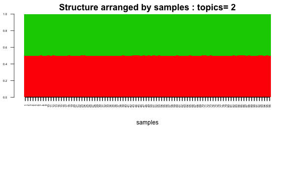
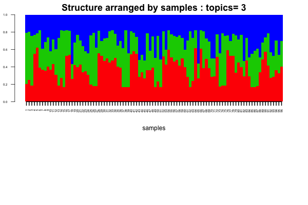
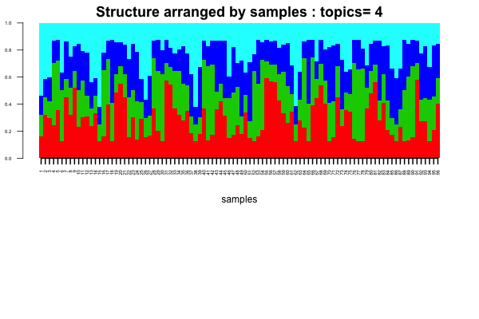
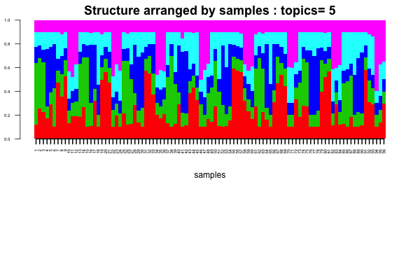

Creating the batch information from the well ids 

```{r echo=TRUE, eval=TRUE}

well_id <- lcl_annotations_refined$well;
ids <- sapply(well_id, function(x) substring(x,2,3))
batch_lab <- array(0, length(ids))
batch_lab[which(ids=="01" | ids=="02" | ids=="03")]=1;
batch_lab[which(ids=="04" | ids=="05" | ids=="06")]=2;
batch_lab[which(ids=="07" | ids=="08" | ids=="09")]=3;
batch_lab[which(ids=="10" | ids=="11" | ids=="12")]=4;

```

We use the batch information to arrange the topic model admixture proportions into a Strutcure plot.

```{r structure_batch, echo=TRUE, eval=TRUE}
samp_metadata <- cbind.data.frame(1:96);
colnames(samp_metadata) = c("samples");
batch_lab <- batch_lab

nclus_vec <- 2:5;

for(num in 1:length(nclus_vec))
{
  if(!dir.exists(paste0("Structure/batch_uncorrected/clus_",nclus_vec[num]))) dir.create(paste0("Structure/batch_uncorrected/clus_",nclus_vec[num]))
  omega <- as.matrix(read.table(paste0("Structure/batch_uncorrected/clus_",nclus_vec[num],"/omega_mat.txt")));
  obj <- StructureObj_omega(omega,samp_metadata = samp_metadata, batch_lab = batch_lab, path=paste0("Structure/batch_uncorrected/clus_",nclus_vec[num]),partition=c('FALSE','TRUE'));
}

```

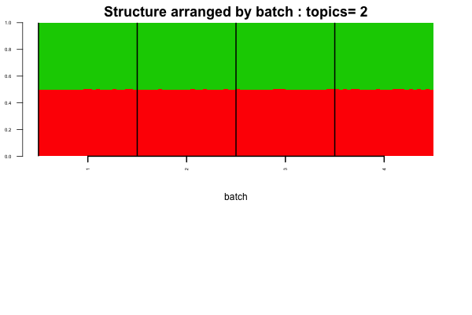
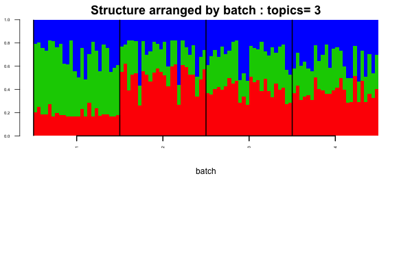
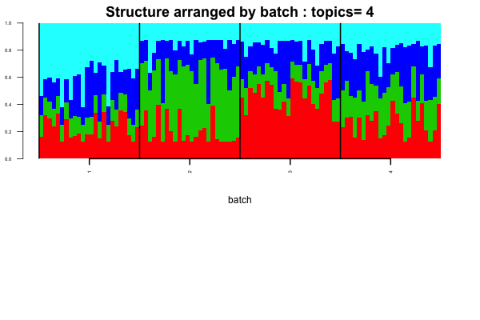
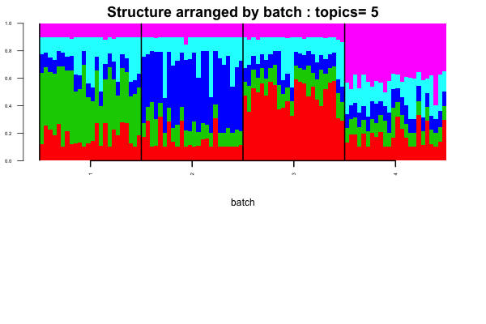


It seems from the above plots there is batch effect in the data and that is most clear for number of topics equal to 4 or 5. It also seems all the batches have very distinct patterns. Now we obtain batch corrected counts.

```{r batch_correct, echo=TRUE, eval=TRUE}

batch_corrected_lcl_molecules <- BatchCorrectedCounts(lcl_molecules_refined,batch_lab,use_parallel=TRUE)

```

Now we apply StructureObj on the batch corrected new counts data and see what patterns we get from the new data analysis, ideally we should not see the batch patterns that we saw in the previous run.

```{r batch_corrected_structure, echo=TRUE, eval=TRUE}

if(!dir.exists("Structure/batch_corrected")) dir.create("Structure/batch_corrected")

#for(num in 1:length(nclus_vec))
#{
#  if(!dir.exists(paste0("Structure/batch_corrected/clus_",nclus_vec[num]))) dir.create(paste0("Structure/batch_corrected/clus_",nclus_vec[num]))
#    obj <- StructureObj(batch_corrected_lcl_molecules,nclus_vec[num],samp_metadata = samp_metadata, tol=0.005, batch_lab = batch_lab, path=paste0("Structure/batch_corrected/clus_",nclus_vec[num]));
#}


for(num in 1:length(nclus_vec))
{
  if(!dir.exists(paste0("Structure/batch_corrected/clus_",nclus_vec[num]))) dir.create(paste0("Structure/batch_corrected/clus_",nclus_vec[num]))
  omega <- as.matrix(read.table(paste0("Structure/batch_corrected/clus_",nclus_vec[num],"/omega_mat.txt")));
    obj <- StructureObj_omega(omega, samp_metadata = samp_metadata, batch_lab = batch_lab, path=paste0("Structure/batch_corrected/clus_",nclus_vec[num]),partition = c("FALSE"));
}

```


The batch removed Structure plots are as follows 

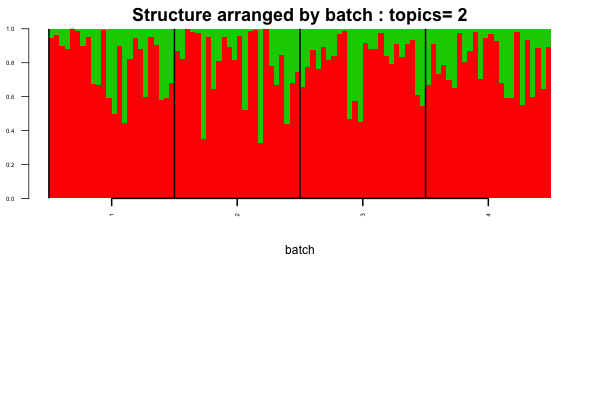
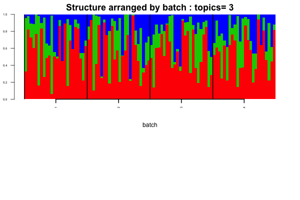
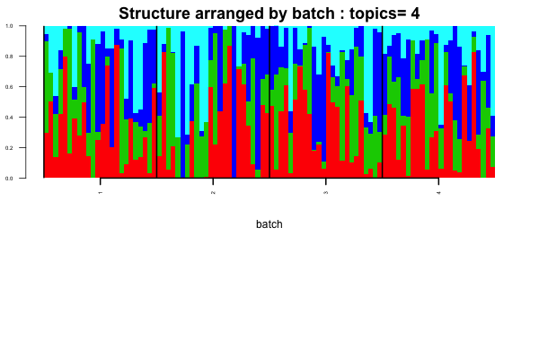
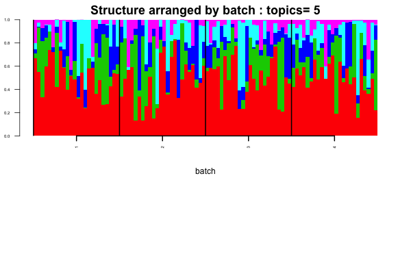

We now assign cell phase to each of the 96 cells and try to see if any cell phase effects are seen in the Structure plot analysis or not. 

We first extract the LCL single cells. 

```{r lcl_single_cells, echo=TRUE, eval=TRUE}

lcl_single_cells <- lcl_molecules_refined[which(lcl_qc_data$cell.num==1),];
```

We find there are `{r dim(lcl_single_cells)[1]} LCL single cells and we also extract the batch labels for these LCLs.

```{r batch_single_cells, echo=TRUE, eval=TRUE}

batch_lab_single_cells <- batch_lab[which(lcl_qc_data$cell.num==1)];

```


Now we assign each of these cells to a particular cell phase. For this we use the LCL reads level data and the cell cycle gene list from the previous single scell study to obtain the cell cycle phases for the single cells. 

```{r cell_cycle_genes, echo=TRUE, eval=TRUE}

cell_cycle_genes <- read.table("../data/cellcyclegenes.txt", header = TRUE, sep="\t")

## create 5 lists of 5 phases (de-level and then remove "")
cell_cycle_genes_list <- lapply(1:5,function(x){
  temp <- as.character(cell_cycle_genes[,x])
  temp[temp!=""]
})


```

We next assign the cell phase scores for each phase to the single cell data and then normalize the results. 

```{r echo=TRUE, eval=TRUE, results='hide'}

reads_lcl <- data.frame(fread('../data/reads-lcl.txt'),row.names=TRUE);
reads_lcl <- reads_lcl[,lcl_indices];
reads_lcl_single <- reads_lcl[,which(lcl_qc_data$cell.num==1)];
reads_single <- as.matrix(reads_lcl_single)


ans <-
sapply(cell_cycle_genes_list,function(xx){
  #### create table of each phase
  reads_single_phase <- reads_single[rownames(reads_single) %in% unlist(xx) ,]
  #### add average expression of all genes in the phase
  combined_matrix <- rbind(reads_single_phase,average=apply(reads_single_phase,2,mean))
  #### use transpose to compute cor matrix
  cor_matrix <- cor(t(combined_matrix))
  #### take the numbers
  cor_vector <- cor_matrix[,dim(cor_matrix)[1]]
  #### restrict to correlation >= 0.3 
  reads_single_phase_restricted <- reads_single_phase[rownames(reads_single_phase) %in% names(cor_vector[cor_vector >= 0.3]),]
  #### apply normalization to reads
  norm_factors_single <- calcNormFactors(reads_single_phase_restricted, method = "TMM")
  reads_single_cpm <- cpm(reads_single_phase_restricted, log = TRUE,
                            lib.size = colSums(reads_single) * norm_factors_single)
  #### output the phase specific scores (mean of normalized expression levels in the phase)
  apply(reads_single_cpm,2,mean)

})

flexible_normalization <- function(data_in,by_row=TRUE){
  if(by_row){
    row_mean <- apply(data_in,1,mean)
    row_sd   <- apply(data_in,1,sd)
    output <- data_in
    for(i in 1:dim(data_in)[1]){
      output[i,] <- (data_in[i,] - row_mean[i])/row_sd[i]
    }
  }
  #### if by column
  if(!by_row){
    col_mean <- apply(data_in,2,mean)
    col_sd   <- apply(data_in,2,sd)
    output <- data_in
    for(i in 1:dim(data_in)[2]){
      output[,i] <- (data_in[,i] - col_mean[i])/col_sd[i]
    }
  }
  output
}

#### apply the normalization function
## first normalized for each phase
ans_normed <- flexible_normalization(ans,by_row=FALSE)
## then normalized of each cell
ans_normed_normed <- flexible_normalization(ans_normed,by_row=TRUE)

cell_phase <- apply(ans_normed_normed,1,function(x) colnames(cell_cycle_genes)[which.max(x)])
assign_cell_phase <- data.frame(cell_phase)

```

We now use the cell-phase to rearrange the Structure plots both before and after the batch correction. First we do the before batch correction (organized by cell phase)

```{r, echo=TRUE, eval=TRUE}

samp_metadata <- cbind.data.frame(as.vector(as.matrix(assign_cell_phase)));
colnames(samp_metadata) = c("cell_phase");
if(!dir.exists("Structure/batch_uncorrected_single")) dir.create("Structure/batch_uncorrected_single")

nclus_vec <- 2:5;

#for(num in 1:length(nclus_vec))
#{
#  if(!dir.exists(paste0("Structure/batch_uncorrected_single/clus_",nclus_vec[num]))) dir.create(paste0("Structure/batch_uncorrected_single/clus_",nclus_vec[num]))
#  obj <- StructureObj(lcl_single_cells,nclus_vec[num],samp_metadata = samp_metadata, tol=0.005, batch_lab = batch_lab_single_cells, path=paste0("Structure/batch_uncorrected_single/clus_",nclus_vec[num]),partition=c('TRUE'));
#}

for(num in 1:length(nclus_vec))
{
  if(!dir.exists(paste0("Structure/batch_uncorrected_single/clus_",nclus_vec[num]))) dir.create(paste0("Structure/batch_uncorrected_single/clus_",nclus_vec[num]))
  omega <- as.matrix(read.table(paste0("Structure/batch_uncorrected_single/clus_",nclus_vec[num],"/omega_mat.txt")));
    obj <- StructureObj_omega(omega, samp_metadata = samp_metadata, batch_lab = batch_lab_single_cells, path=paste0("Structure/batch_uncorrected_single/clus_",nclus_vec[num]),partition = c("TRUE"));
}
```

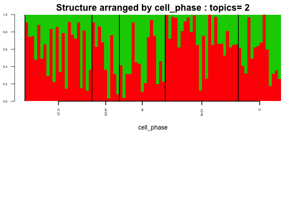
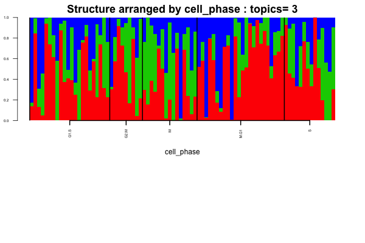
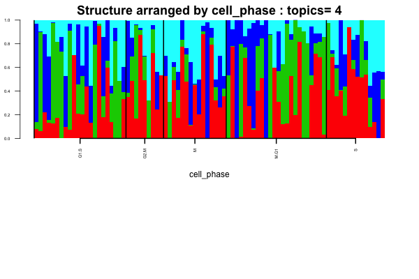
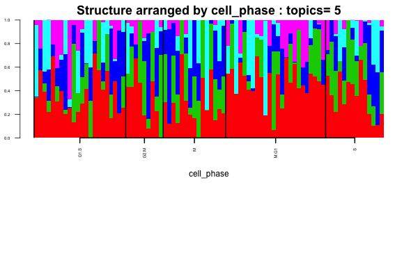

Now we perform the batch corrected counts.

```{r echo=TRUE, eval=TRUE}

batch_corrected_lcl_single <- BatchCorrectedCounts(lcl_single_cells,batch_lab_single_cells,use_parallel=TRUE)

```

Now we use the Structure model on the batch corrected counts.

```{r echo=TRUE, eval=TRUE}

if(!dir.exists("Structure/batch_corrected_single")) dir.create("Structure/batch_corrected_single")

#for(num in 1:length(nclus_vec))
#{
#  if(!dir.exists(paste0("Structure/batch_corrected_single/clus_",nclus_vec[num]))) dir.create(paste0("Structure/batch_corrected_single/clus_",nclus_vec[num]))
#  obj <- StructureObj(batch_corrected_lcl_single,nclus_vec[num],samp_metadata = samp_metadata, tol=0.001, batch_lab = batch_lab_single_cells, path=paste0("Structure/batch_corrected_single/clus_",nclus_vec[num]),partition=c('TRUE'));
#}

for(num in 1:length(nclus_vec))
{
  if(!dir.exists(paste0("Structure/batch_corrected_single/clus_",nclus_vec[num]))) dir.create(paste0("Structure/batch_corrected_single/clus_",nclus_vec[num]))
  omega <- as.matrix(read.table(paste0("Structure/batch_corrected_single/clus_",nclus_vec[num],"/omega_mat.txt")));
    obj <- StructureObj_omega(omega, samp_metadata = samp_metadata, batch_lab = batch_lab_single_cells, path=paste0("Structure/batch_corrected_single/clus_",nclus_vec[num]),partition = c("TRUE"));
}
```


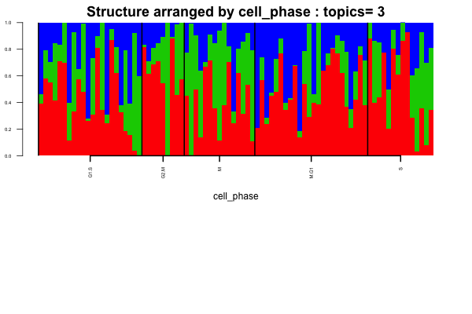
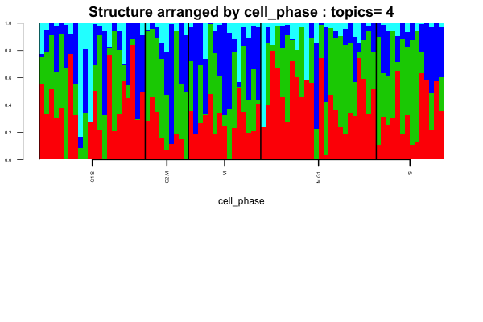
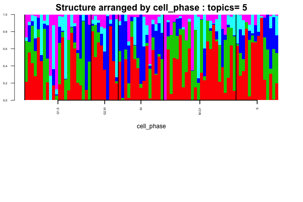