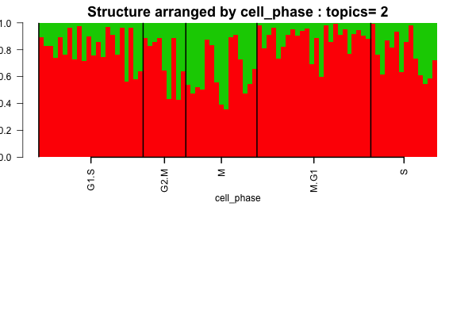
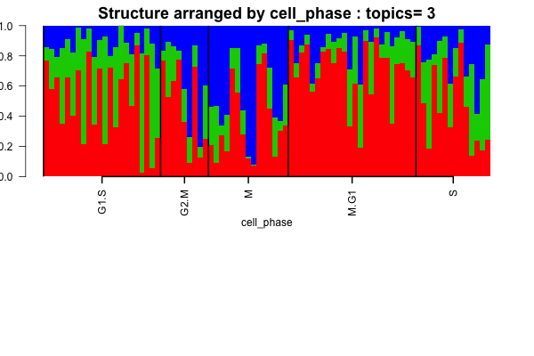
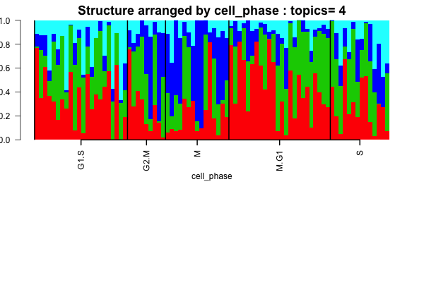
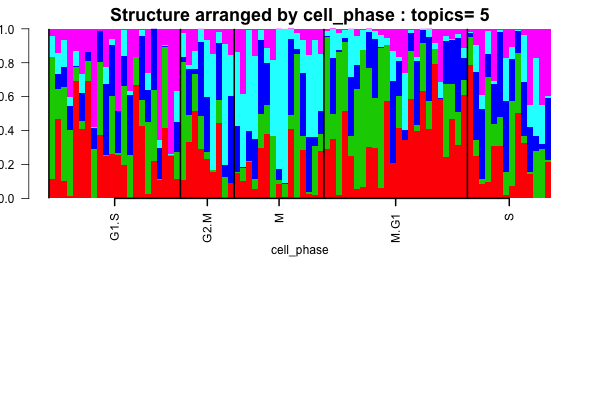
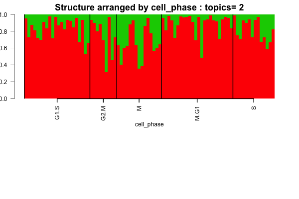
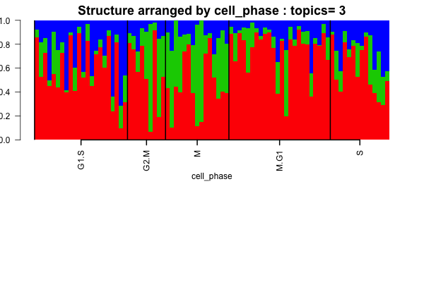
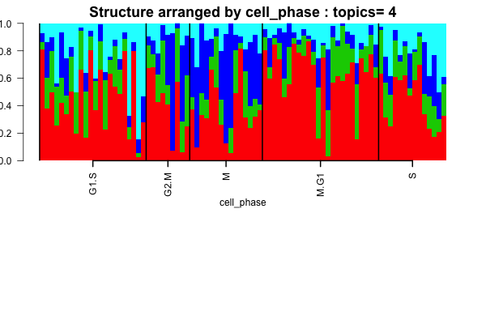

### Objective

In this script, we perform Structure analysis on LCLs based on the cell cycle genes only. 

```{r echo=TRUE, eval=TRUE}
rm(list=ls())
setwd('/Users/kushal/Documents/singleCell-method/project/LCL/src')
suppressMessages(suppressWarnings(library(CountClust)))
suppressMessages(suppressWarnings(library(data.table)))
suppressMessages(suppressWarnings(library(gplots)))
suppressMessages(suppressWarnings(library(philentropy)))
suppressMessages(suppressWarnings(library(dplyr)))
suppressMessages(suppressWarnings(library(edgeR)))
suppressMessages(suppressWarnings(library(qtlcharts)))
suppressMessages(suppressWarnings(library(limma)))
suppressMessages(suppressWarnings(library(readr)))
```


## Prepare the LCL data

We first prepare the LCL single cell data. 

```{r echo=TRUE, eval=TRUE}

lcl_qc_data <- read_csv("../data/qc-lcl.csv");
lcl_annotations <- read.table('../data/annotation-lcl.txt',header=TRUE);
lcl_molecules <- t(data.frame(fread('../data/molecules-lcl.txt'), row.names = 1));

lcl_indices <- match(lcl_qc_data$ll_name, lcl_annotations$well)

lcl_molecules_refined <- lcl_molecules[lcl_indices,];
lcl_annotations_refined <- lcl_annotations[lcl_indices,];

well_id <- lcl_annotations_refined$well;
ids <- sapply(well_id, function(x) substring(x,2,3))
batch_lab <- array(0, length(ids))
batch_lab[which(ids=="01" | ids=="02" | ids=="03")]=1;
batch_lab[which(ids=="04" | ids=="05" | ids=="06")]=2;
batch_lab[which(ids=="07" | ids=="08" | ids=="09")]=3;
batch_lab[which(ids=="10" | ids=="11" | ids=="12")]=4;


lcl_single_cells <- lcl_molecules_refined[which(lcl_qc_data$cell.num==1),];
batch_lab_single_cells <- batch_lab[which(lcl_qc_data$cell.num==1)];
```

We next assign the cell phase scores for each phase to the single cell data and then normalize the results. 

```{r echo=TRUE, eval=TRUE, results='hide'}
reads_lcl <- data.frame(fread('../data/reads-lcl.txt'),row.names=TRUE);
reads_lcl <- reads_lcl[,lcl_indices];
reads_lcl_single <- reads_lcl[,which(lcl_qc_data$cell.num==1)];
reads_single <- as.matrix(reads_lcl_single)

cell_cycle_genes <- read.table("../data/cellcyclegenes.txt", header = TRUE, sep="\t")

## create 5 lists of 5 phases (de-level and then remove "")
cell_cycle_genes_list <- lapply(1:5,function(x){
  temp <- as.character(cell_cycle_genes[,x])
  temp[temp!=""]
})


ans <-
sapply(cell_cycle_genes_list,function(xx){
  #### create table of each phase
  reads_single_phase <- reads_single[rownames(reads_single) %in% unlist(xx) ,]
  #### add average expression of all genes in the phase
  combined_matrix <- rbind(reads_single_phase,average=apply(reads_single_phase,2,mean))
  #### use transpose to compute cor matrix
  suppressWarnings(cor_matrix <- cor(t(combined_matrix)))
  #### take the numbers
  cor_vector <- cor_matrix[,dim(cor_matrix)[1]]
  #### restrict to correlation >= 0.3 
  reads_single_phase_restricted <- reads_single_phase[rownames(reads_single_phase) %in% names(cor_vector[cor_vector >= 0.3]),]
  #### apply normalization to reads
  norm_factors_single <- calcNormFactors(reads_single_phase_restricted, method = "TMM")
  reads_single_cpm <- cpm(reads_single_phase_restricted, log = TRUE,
                            lib.size = colSums(reads_single) * norm_factors_single)
  #### output the phase specific scores (mean of normalized expression levels in the phase)
  apply(reads_single_cpm,2,mean)

})

flexible_normalization <- function(data_in,by_row=TRUE){
  if(by_row){
    row_mean <- apply(data_in,1,mean)
    row_sd   <- apply(data_in,1,sd)
    output <- data_in
    for(i in 1:dim(data_in)[1]){
      output[i,] <- (data_in[i,] - row_mean[i])/row_sd[i]
    }
  }
  #### if by column
  if(!by_row){
    col_mean <- apply(data_in,2,mean)
    col_sd   <- apply(data_in,2,sd)
    output <- data_in
    for(i in 1:dim(data_in)[2]){
      output[,i] <- (data_in[,i] - col_mean[i])/col_sd[i]
    }
  }
  output
}

#### apply the normalization function
## first normalized for each phase
ans_normed <- flexible_normalization(ans,by_row=FALSE)
## then normalized of each cell
ans_normed_normed <- flexible_normalization(ans_normed,by_row=TRUE)

cell_phase <- apply(ans_normed_normed,1,function(x) colnames(cell_cycle_genes)[which.max(x)])
assign_cell_phase <- data.frame(cell_phase)

```

Extract the cell cycle genes and define the new counts data only focusing on the cell cycle genes.

```{r echo=TRUE, eval=TRUE}

labs=unique(unlist(lapply(1:5, function(k) match(cell_cycle_genes_list[[k]],colnames(lcl_single_cells)))));
labs = labs[!is.na(labs)];
lcl_single_cell_cycle_genes <- lcl_single_cells[,labs];

```

### Batch Uncorrected Model

We have in total `r length(labs) ` cell cycle genes that we use in our analysis and now we perform the Structure analysis on the counts data of the LCLs and the cell cycle genes without the batch effect correction.

```{r echo=TRUE, eval=TRUE}
samp_metadata <- cbind.data.frame(as.vector(as.matrix(assign_cell_phase)));
colnames(samp_metadata) = c("cell_phase");

nclus_vec <- 2:5;

#StructureObj(lcl_single_cell_cycle_genes,nclus_vec,samp_metadata = samp_metadata, tol=0.001, batch_lab = NULL, path_rda="../../../project/rdas/topic_fit_lcl_cellcycle.rda",partition=c('TRUE'),path_struct = NULL);


lcl_cellcycle_topics <- get(load("../../../project/rdas/topic_fit_lcl_cellcycle.rda"));

if(!dir.exists("../../figures/lcl_cellcycle_structure")) dir.create("../../figures/lcl_cellcycle_structure")

for(num in 1:length(nclus_vec))
{
 if(!dir.exists(paste0("../../figures/lcl_cellcycle_structure/clus_",nclus_vec[num]))) dir.create(paste0("../../figures/lcl_cellcycle_structure/clus_",nclus_vec[num]))
obj <- StructureObj_omega(lcl_cellcycle_topics[[num]]$omega, samp_metadata = samp_metadata, batch_lab = NULL,partition = rep("TRUE",dim(samp_metadata)[2]),path_struct=paste0('../../figures/lcl_cellcycle_structure/clus_',nclus_vec[num]),control=list(cex.axis=1));
}

```






### Batch Corrected Model

Now we perform batch level correction on the counts data over the cell cycle genes. 

```{r batch_correct, echo=TRUE, eval=TRUE}
batch_corrected_cell_cycle_genes <- BatchCorrectedCounts(lcl_single_cell_cycle_genes,batch_lab_single_cells,use_parallel=TRUE)

```

We now perform the Structure plot analysis on the LCL single data, using only the cell cycle genes. 

```{r echo=TRUE, eval=TRUE}

samp_metadata <- cbind.data.frame(as.vector(as.matrix(assign_cell_phase)));
colnames(samp_metadata) = c("cell_phase");

nclus_vec <- 2:5;

#StructureObj(batch_corrected_cell_cycle_genes,nclus_vec,samp_metadata = samp_metadata, tol=0.001, batch_lab = NULL, path_rda="../../../project/rdas/topic_fit_lcl_cellcycle_batchcorrect.rda",partition=c('TRUE'),path_struct = NULL);


lcl_cellcycle_topics_batchcorrect <- get(load("../../../project/rdas/topic_fit_lcl_cellcycle_batchcorrect.rda"));

if(!dir.exists("../../figures/lcl_cellcycle_batchcorrect_structure")) dir.create("../../figures/lcl_cellcycle_batchcorrect_structure")

for(num in 1:length(nclus_vec))
{
 if(!dir.exists(paste0("../../figures/lcl_cellcycle_batchcorrect_structure/clus_",nclus_vec[num]))) dir.create(paste0("../../figures/lcl_cellcycle_batchcorrect_structure/clus_",nclus_vec[num]))
obj <- StructureObj_omega(lcl_cellcycle_topics_batchcorrect[[num]]$omega, samp_metadata = samp_metadata, batch_lab = NULL,partition = rep("TRUE",dim(samp_metadata)[2]),path_struct=paste0('../../figures/lcl_cellcycle_batchcorrect_structure/clus_',nclus_vec[num]),control=list(cex.axis=1));
}

```





