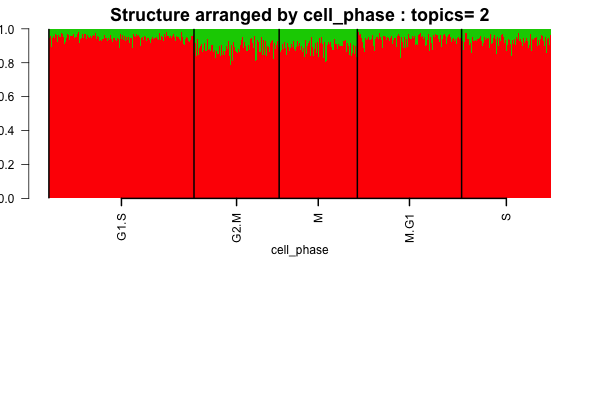
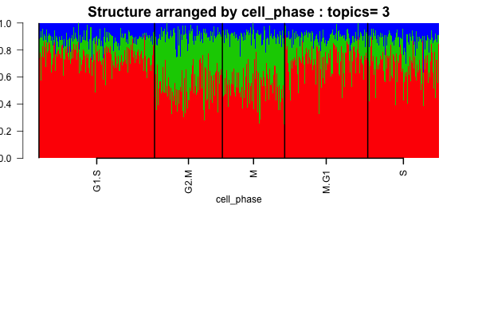
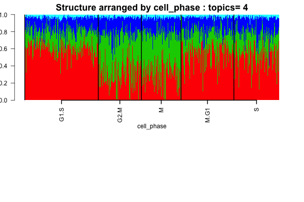
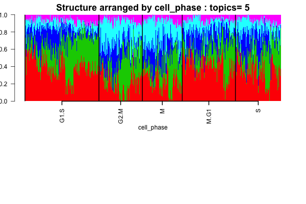
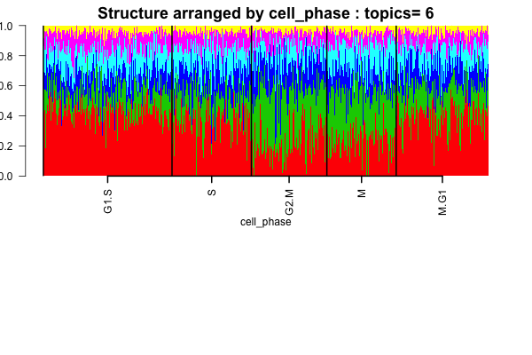
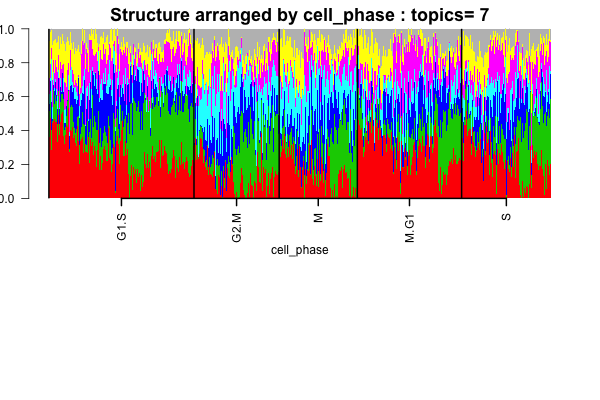

## Goal 

In this script, we use a batch effect modeling of the single cells using only the cell cycle genes and then see if on removing the batch effects and the individual effects, the residuals indeed cluster by the cell phase or cell cycle or not. 


We first load the packages and the data.

```{r message = FALSE, warning = FALSE}
library(CountClust)
library(data.table)
library(maptpx)
library(gplots)
library(philentropy)
library(dplyr)
library(edgeR)
library(tsne)
library(qtlcharts)
library(limma)
```


## Prepare data

```{r}
reads <- data.frame(fread('../data/reads.txt'),row.names=1);
molecules <-  data.frame(fread('../data/molecules.txt'),row.names=1);
```


```{r}
quality_single_cells <- scan("../data/quality-single-cells.txt",
                             what = "character")
anno <- data.frame(fread('../data/annotation.txt'));
```


Remove bulk samples and include only quality single cells.

```{r}
molecules <- molecules[, grepl("bulk", colnames(molecules)) |
                         colnames(molecules) %in% quality_single_cells]
anno <- anno[anno$well == "bulk" | anno$sample_id %in% quality_single_cells, ]
stopifnot(ncol(molecules) == nrow(anno),
          colnames(molecules) == anno$sample_id)

reads <- reads[, grepl("bulk", colnames(reads)) |
                         colnames(reads) %in% quality_single_cells]
stopifnot(ncol(reads) == nrow(anno),
          colnames(reads) == anno$sample_id)
```


Remove genes with 0 count across single cells.

```{r}
expressed <- rowSums(molecules[, anno$well == "bulk"]) > 0 &
             rowSums(molecules[, anno$well != "bulk"]) > 0
molecules <- molecules[expressed, ]

expressed <- rowSums(reads[, anno$well == "bulk"]) > 0 &
             rowSums(reads[, anno$well != "bulk"]) > 0
reads <- reads[expressed, ]

molecules_single <- molecules %>% select(-contains("bulk"))
reads_single <- reads %>% select(-contains("bulk"))
```


Remove genes with max molecule numer larger than 1024

```{r}
molecules_single <- molecules_single[apply(molecules_single,1,max) < 1024,];
```


## Cell-cycle genes

Now we draw a list of marker genes that have cell cycle information.

```{r}
cell_cycle_genes <- read.table("../data/cellcyclegenes.txt", header = TRUE, sep="\t")

## create 5 lists of 5 phases (de-level and then remove "")
cell_cycle_genes_list <- lapply(1:5,function(x){
  temp <- as.character(cell_cycle_genes[,x])
  temp[temp!=""]
})

labs <- unique(unlist(lapply(1:5, function(k) 
                            match(cell_cycle_genes_list[[k]],
                            rownames(molecules_single)))) )
labs <- labs[!is.na(labs)]
molecules_single_cell_cycle <- molecules_single[labs,]
```


We fix the cell phase scores

```{r}
ans <-
    sapply(cell_cycle_genes_list,function(xx){
      #### create table of each phase
      reads_single_phase <- reads_single[rownames(reads_single) %in% unlist(xx) ,]
      #### add average expression of all genes in the phase
      combined_matrix <- rbind(reads_single_phase,average=apply(reads_single_phase,2,mean))
      #### use transpose to compute cor matrix
      cor_matrix <- cor(t(combined_matrix))
      #### take the numbers
      cor_vector <- cor_matrix[,dim(cor_matrix)[1]]
      #### restrict to correlation >= 0.3 
      reads_single_phase_restricted <- reads_single_phase[rownames(reads_single_phase) %in% names(cor_vector[cor_vector >= 0.3]),]
      #### apply normalization to reads
      norm_factors_single <- calcNormFactors(reads_single_phase_restricted, method = "TMM")
      reads_single_cpm <- cpm(reads_single_phase_restricted, log = TRUE,
                                lib.size = colSums(reads_single) * norm_factors_single)
      #### output the phase specific scores (mean of normalized expression levels in the phase)
      apply(reads_single_cpm,2,mean)
})

#### normalization function
flexible_normalization <- function(data_in,by_row=TRUE){
  if(by_row){
    row_mean <- apply(data_in,1,mean)
    row_sd   <- apply(data_in,1,sd)
    output <- data_in
    for(i in 1:dim(data_in)[1]){
      output[i,] <- (data_in[i,] - row_mean[i])/row_sd[i]
    }
  }
  #### if by column
  if(!by_row){
    col_mean <- apply(data_in,2,mean)
    col_sd   <- apply(data_in,2,sd)
    output <- data_in
    for(i in 1:dim(data_in)[2]){
      output[,i] <- (data_in[,i] - col_mean[i])/col_sd[i]
    }
  }
  output
}

#### apply the normalization function
## first normalized for each phase
ans_normed <- flexible_normalization(ans,by_row=FALSE)
## then normalized of each cell
ans_normed_normed <- flexible_normalization(ans_normed,by_row=TRUE)

cell_phase <- apply(ans_normed_normed,1,function(x) colnames(cell_cycle_genes)[which.max(x)])
assign_cell_phase <- data.frame(cell_phase)
cell_phase_vector <- as.vector(as.matrix(assign_cell_phase));
cell_phase_vector <- factor(cell_phase_vector, 
                            levels = c("G1.S", "S", "G2.M", "M", "M.G1"))
```


## Batch effect correction

Now we apply a linear model taking into account the individual effect and the batch effect and grab the residuals free of individual and batch effects. We used the CPM corrected data for batch effect modeling.


### Remove batch effect

We fit for every gene the following model across individuals and batches:

$$ y_{ijk} = \mu + \alpha_i + \beta_{ij} + \epsilon_{ijk}$$,

where $y_{ijk}$ is log2 CPM of each gene in individual $i$, batch$i$ and cell$k$. The batch-corrected log2-CPM is computed as $y_{ijk} - \hat{\alpha}_i - \hat{\beta}_{ij}$.


```{r echo=TRUE, eval=TRUE}
counts_data <- t(molecules_single_cell_cycle)
cpm_data <- voom(counts_data)$E

individual_id <- sapply(1:length(rownames(cpm_data)), 
                        function(x) strsplit(rownames(cpm_data)[x],"[.]")[[1]][1])

batch_id <- sapply(1:length(rownames(cpm_data)), 
                   function(x) strsplit(rownames(cpm_data)[x],"[.]")[[1]][2])

batch_removed_cpm <- matrix(0,dim(cpm_data)[1], dim(cpm_data)[2])
```


Now on the logCPM data, we apply a linear model taking into account the individual effect and the batch effect and grab the residuals free of individual and batch effects.

```{r}
counts_data <- t(molecules_single_cell_cycle)
cpm_data <- voom(counts_data)$E

individual_id <- sapply(1:length(rownames(cpm_data)), function(x) 
                        strsplit(rownames(cpm_data)[x],"[.]")[[1]][1])

batch_id <- sapply(1:length(rownames(cpm_data)), function(x)
                    strsplit(rownames(cpm_data)[x],"[.]")[[1]][2]);

batch_removed_cpm <- matrix(0,dim(cpm_data)[1], dim(cpm_data)[2]);
for(g in 1:dim(cpm_data)[2])
{
  res <- as.numeric(lm(cpm_data[,g] ~ individual_id+batch_id)$residuals);
  batch_removed_cpm[,g] <- res;
}
col <- c(rgb(seq(0,1,length=15),1,seq(0,1,length=15)),
         rgb(1,seq(1,0,length=15),seq(1,0,length=15)))
```

Heatmap of the variance-covariance matrix of the batch corrected data.

```{r}
library(gplots)
par( mar = c(4,4,4,4) )
cor_batch <- cor(t(batch_removed_cpm));
heatmap.2(cor_batch,scale="none", trace="none",
          labRow = cell_phase_vector,labCol = cell_phase_vector,
          breaks = c(seq(-1,0,0.07), seq(0,0.5,0.05), seq(0.6,1,0.1)),
          col = col, distfun=function(x) dist(x,method="euclidean"),
          hclustfun=function(x) hclust(x,method="average"))
out <- kmeans(batch_removed_cpm,5);
xtabs(~out$cluster+cell_phase_vector)
```

None of the hierarchical clustering heatmaps or the kmeans algorithm seem to show distinct clusters of the cell cycle effects. We take the exponent of the normalized terms, apply an admixture model to the remodeled normalized data.

CJH: This shows the mean differences are removed in the batch-corrected data.


### Batch-corrected counts

Check if the admixture output exists already. If not, compute clustering
assignment for possible groupings of 2 to 7. 

```{r}
nclus_vec <- 2:7
samp_metadata <- cbind.data.frame(individual_id, cell_phase_vector);
colnames(samp_metadata) <- c("individual","cell_phase");
if(!dir.exists("../figures/ipsc_structure_batchcorrect_cellcycle")) dir.create("../figures/ipsc_structure_batchcorrect_cellcycle")

if(file.exists("../../project/rdas/topic_fit_ipsc_batchcorrect_cellcycle.rda")) {
ipsc_topics_cellcycle_batchcorrect <- get(load("../../project/rdas/topic_fit_ipsc_batchcorrect_cellcycle.rda"));
} else {
    individual.batch.id <- paste0(individual_id,"_", batch_id);
    batch_corrected_counts <- BatchCorrectedCounts(counts_data,individual.batch.id);
    StructureObj(batch_corrected_counts ,nclus_vec,samp_metadata = samp_metadata, tol=0.005, batch_lab = batch_id, path_rda="../../project/rdas/topic_fit_ipsc_batchcorrect_cellcycle.rda",path_struct = "../figures/ipsc_structure_batchcorrect_cellcycle");
    
ipsc_topics_cellcycle_batchcorrect <- get(load("../../project/rdas/topic_fit_ipsc_batchcorrect_cellcycle.rda"));
}

for(num in 1:length(nclus_vec))
{
obj <- StructureObj_omega(ipsc_topics_cellcycle_batchcorrect[[num]]$omega, samp_metadata = samp_metadata, batch_lab = batch_id,partition = rep("TRUE",dim(samp_metadata)[2]),path_struct="../figures/ipsc_structure_batchcorrect_cellcycle",control=list(cex.axis=1));
}

```

Structure plots by cell phase









#### Gene assignment weights (Theta)

For a $k$-cluster assignemnt, the admixture model assigns each gene a weight for its
relative contribution to the cluster. 

##### 2 clusters

Consider a 2-cluster scenario.

```{r}
topics_clust <- ipsc_topics_cellcycle_batchcorrect[[1]]
clust <- topics_clust$K
word_weights <- topics_clust$theta
```

Order genes by difference between cluster weights.

```{r}
word_order <- order(abs(word_weights[,1] - word_weights[,2]) )
matplot(word_weights[word_order, ], type = "l",
        ylab = "cluster weights",
        xlab = "genes ordered by differences between two cluster weights",
        main = "2 clusters")
```

Output genes ordered by absolute differences between the two clusters

```{r}
geneNames <- rownames(molecules_single_cell_cycle)
if (!file.exists("../output/batch_effect_cell_cycle_genes/batch-corrected-clust-2.txt")) {
write.table(rev(geneNames[word_order]),
            file = "../output/batch_effect_cell_cycle_genes/batch-corrected-clust-2.txt",
            quote = FALSE, col.names = FALSE, row.names = FALSE)
}
```

List out hgnc symbol for the top 20 genes that distinguish the clusters.

```{r}
library(biomaRt)
library(knitr)
# define biomart object
mart <- useMart(biomart = "ensembl", dataset = "hsapiens_gene_ensembl")
# query biomart
results <- getBM(attributes = c("hgnc_symbol", "description"), 
                 filters = "ensembl_gene_id", 
                 values = rev(geneNames[word_order])[1:20],
                 mart = mart)
kable(as.data.frame(results))
```


##### 3 clusters

```{r}
topics_clust <- ipsc_topics_cellcycle_batchcorrect[[2]]
clust <- topics_clust$K
word_weights <- topics_clust$theta
```

Order genes by difference between cluster weights. Compute differences based on
mean of absolute deviation from the median.

```{r}
diff_vec <- apply(word_weights, 1 , function(per_gene) {
                    mean(abs(per_gene - median(per_gene)))
            })
matplot(word_weights[order(diff_vec), ], type = "l",
        ylab = "cluster weights",
        xlab = "genes ordered by distances between cluster weights",
        main = "3 clusters")
```

Output genes ordered by distance among clusters

```{r}
geneNames <- rownames(molecules_single_cell_cycle)
if (!file.exists("../output/batch_effect_cell_cycle_genes/batch-corrected-clust-3.txt")) {
write.table(rev(geneNames[order(diff_vec)]),
            file = "../output/batch_effect_cell_cycle_genes/batch-corrected-clust-3.txt",
            quote = FALSE, col.names = FALSE, row.names = FALSE)
}
```


List out hgnc symbol for the top 20 genes that distinguish the two clusters.

```{r}
library(biomaRt)
library(knitr)
# define biomart object
mart <- useMart(biomart = "ensembl", dataset = "hsapiens_gene_ensembl")
# query biomart
results <- getBM(attributes = c("hgnc_symbol", "description"), 
                 filters = "ensembl_gene_id", 
                 values = rev(geneNames[order(diff_vec)])[1:20],
                 mart = mart)
kable(as.data.frame(results))
```


## Session information

```{r}
sessionInfo()
```

