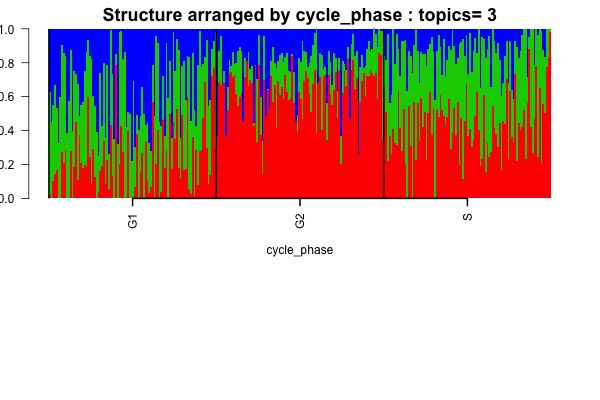
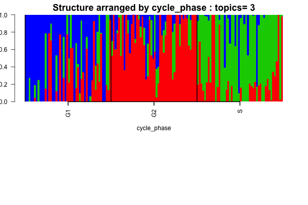

```{r echo=TRUE, eval=TRUE, warning=FALSE, message=FALSE}
rm(list=ls())
library(maptpx)
library(CountClust)
library(classtpx)
library(limma)
library(data.table)
```


## Overview

When `classtpx` was used on the combined single cell RNA-seq FACS sorted data due to [Buettner et al 2015](http://www.nature.com/nbt/journal/v33/n2/full/nbt.3102.html) and the bulk RNA FACS sorted data due to [Scialdone et al 2015](http://www.sciencedirect.com/science/article/pii/S1046202315300098). The results were not very satisfactory as the classifier on test data would always put them in the G1 phase cluster. 

The idea now is to explore the Buettner et al data and try to see if the difference in library size between the single cell RNA-seq and the bulk RNA-seq model when used jointly as in this case, is indeed a problem. 

## Buettner et al 2015 data 

```{r echo=TRUE, eval=TRUE}
library(data.table)
G1_single <- data.frame(fread('../data/Marioni_data/G1_singlecells_counts.txt'), row.names=1);
G2M_single <- data.frame(fread('../data/Marioni_data/G2M_singlecells_counts.txt'), row.names=1);
S_single <- data.frame(fread('../data/Marioni_data/S_singlecells_counts.txt'), row.names=1);

cell_phases <- c(rep("G1", 96), rep("S", 96), rep("G2M", 96))
```

We filter out ERCC spike ins.

```{r echo=TRUE, eval=TRUE}
ercc_start <- grep("ERCC", rownames(G1_single))[1]
G1_single <- G1_single[-(ercc_start:dim(G1_single)[1]),-(1:3)];
G2M_single <- G2M_single[-(ercc_start:dim(G2M_single)[1]),-(1:3)];
S_single <- S_single[-(ercc_start:dim(S_single)[1]),-(1:3)];
pooled_data <- t(cbind(G1_single, S_single, G2M_single));
```


## maptpx Modeling

```{r echo=TRUE, eval=FALSE}
Topic_clus <- maptpx::topics(pooled_data, K=3, tol=0.01);
saveRDS(Topic_clus, "../rdas/botstein_topic_fit.rda")
```

```{r echo=TRUE, eval=TRUE}
Topic_clus <- readRDS("../rdas/botstein_topic_fit.rda")

samp_metadata <- cbind.data.frame(c(rep("G1", 96), rep("S", 96), rep("G2", 96)));
colnames(samp_metadata) <- c("cycle_phase");

if(!dir.exists("../figures/buettner_structure/")) dir.create("../figures/buettner_structure/")

if(!dir.exists("../figures/buettner_structure/maptpx/")) dir.create("../figures/buettner_structure/maptpx/")

library(CountClust)
obj <- StructureObj_omega(Topic_clus$omega, samp_metadata = samp_metadata, batch_lab = NULL,partition = rep("TRUE",dim(samp_metadata)[2]),path_struct="../figures/buettner_structure/maptpx/",control=list(cex.axis=1));
```



## Manufacturing bulk data

We now pool the first 48 cells in each of the three phases and sum the read counts across up over the cells for each gene to make them represent bulk-RNA FACS sorted data. We keep the remaining 48 cells in each phase as it is as single cells on which we shall test the `classtpx`.

```{r echo=TRUE, eval=TRUE}

G1.bulk <- rowSums(G1_single[,1:48])
G1_single_half <- G1_single[,-(1:48)];
G2M.bulk <- rowSums(G2M_single[,1:48])
G2M_single_half <- G2M_single[,-(1:48)];
S.bulk <- rowSums(S_single[,1:48])
S_single_half <- S_single[,-(1:48)];

bulk_data <- cbind(G1.bulk, S.bulk, G2M.bulk);
sc_data <- cbind(G1_single_half, G2M_single_half, S_single_half);

pooled_data <- t(cbind(bulk_data, sc_data));

```

## classtpx Modeling

Fitting classtpx. We assume that we have done the bulk-RNA FACS sorting and we do not know about the cell cycle phases of the single phases. We use this information to drive the `classtpx`.

```{r echo=TRUE, eval=FALSE}
library(classtpx)
K <- 3;
known_indices <- 1:3;
omega_known <- rbind(c(1,0,0), c(0,1,0), c(0,0,1));
Topic_clus <- classtpx::class_topics(pooled_data, K, known_indices = known_indices, omega_known = omega_known, tol=0.001);

saveRDS(Topic_clus, "../rdas/botstein_topic_fit_classtpx.rda")
```

```{r echo=TRUE, eval=TRUE}
Topic_clus <- readRDS("../rdas/botstein_topic_fit_classtpx.rda")

samp_metadata <- cbind.data.frame(c(rep("G1", 48), rep("S", 48), rep("G2", 48)));
colnames(samp_metadata) <- c("cycle_phase");

if(!dir.exists("../figures/buettner_structure/")) dir.create("../figures/buettner_structure/")

if(!dir.exists("../figures/buettner_structure/classtpx/")) dir.create("../figures/buettner_structure/classtpx/")

library(CountClust)
obj <- StructureObj_omega(Topic_clus$omega[-(1:3),], samp_metadata = samp_metadata, batch_lab = NULL,partition = rep("TRUE",dim(samp_metadata)[2]),path_struct="../figures/buettner_structure/classtpx/",control=list(cex.axis=1));
```



## PCA 

We perform PCA to see where the bulk samples and the single cell samples lie in the combined PCA plot with the voom transform. Note that the main difference between the bulk samples and single cell samples here is the library size, which is way higher in case of bulk samples.

```{r echo=TRUE, eval=TRUE}
color <- c(2,3,4, rep(2,48), rep(3, 48), rep(4,48));
out_pca <- prcomp(limma::voom(pooled_data)$E);
par(mfrow=c(1,1))
plot(out_pca$x[,1], out_pca$x[,2], col=color, pch=c(rep(3,3), rep(20,144)), xlab="PC1",
     ylab="PC2")
legend("topleft", c("G1","S", "G2M"), fill=c(2,3,4), cex=0.6)

plot(out_pca$x[,1], out_pca$x[,3], col=color, pch=c(rep(3,3), rep(20,144)), xlab="PC1",
     ylab="PC2")
legend("topleft", c("G1","S", "G2M"), fill=c(2,3,4), cex=0.6)

```

Note that PC1 vs PC2 or PC2 vs PC3 plots do not seem to match the single cells from different phases with the bulk samples from that phase. 

## Conclusions

`classtpx` does a good job at separating the single cells into their cell cycle phases based on the bulk data manufactured by pooling some of these single cells together. It fixes the identifiability problem as encountered when `maptpx` is applied to all the single cells. `maptpx` writes the cells from three phases as a homogeneous (within each phase) mix of three clusters instead of placing them in separate clusters for separate phases, the latter is achieved by `classtpx`. Also it seems PCA is not flexible enough to account for the library size effect which topic model does take care of. 
