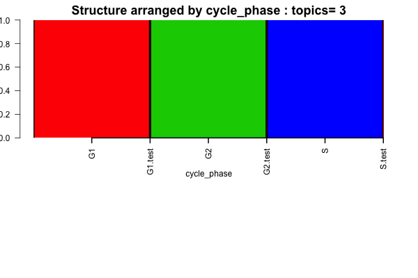
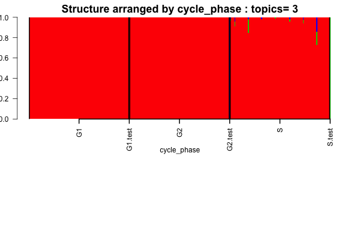

## Overview

We apply the `classtpx` technique to classify the G1, G2 and S cells from two experiments in mouse RNA-seq. The dataset E-MTAB-2805 comprises of sequencing data on 96 cells each from G1, G2 and S phases of the cell cycle. Check  [site](http://www.ebi.ac.uk/arrayexpress/experiments/E-MTAB-2805/). For the associated paper, check [Buettner et al 2015](http://www.nature.com/nbt/journal/v33/n2/full/nbt.3102.html). 

We also have data on G1, G2 and S cells from the [Scialdone et al 2015](http://www.sciencedirect.com/science/article/pii/S1046202315300098) and the dataset ID is E-MTAB-3749 (FACS sorted data on G1, G2 and S cells). 

Both the experiments were conducted on mice. In this paper, we shall build a classifier using the Buettner data to classify the Scialdone data and vice versa.

## classtpx Fitting

We first use the `classtpx` package to build a semi-supervised topic model using the Buettner data to build the classifier and use it on the Scialdone data as test data. 

### Buettner et al 2015 

```{r echo=TRUE, eval=TRUE}
library(data.table)
G1_single <- data.frame(fread('../data/Marioni_data/G1_singlecells_counts.txt'), row.names=1);
G2M_single <- data.frame(fread('../data/Marioni_data/G2M_singlecells_counts.txt'), row.names=1);
S_single <- data.frame(fread('../data/Marioni_data/S_singlecells_counts.txt'), row.names=1);

cell_phases <- c(rep("G1", 96), rep("S", 96), rep("G2M", 96))

```

We filter out ERCC spike ins.

```{r echo=TRUE, eval=TRUE}
ercc_start <- grep("ERCC", rownames(G1_single))[1]
G1_single <- G1_single[-(ercc_start:dim(G1_single)[1]),-(1:3)];
G2M_single <- G2M_single[-(ercc_start:dim(G2M_single)[1]),-(1:3)];
S_single <- S_single[-(ercc_start:dim(S_single)[1]),-(1:3)];
pooled_data <- t(cbind(G1_single, S_single, G2M_single));
```

### Scialdone et al 2015

```{r echo=TRUE, eval=TRUE}
G1_data <- read.table("../data/Scialdone2015data/G1_htseq_count.txt");
G2M_data <- read.table("../data/Scialdone2015data/G2M_htseq_count.txt");
S_data <- read.table("../data/Scialdone2015data/S_htseq_count.txt");
facs_data <- cbind.data.frame(G1_data[,1], G1_data[,2], S_data[,2], G2M_data[,2]);
colnames(facs_data) <- c("genes", "G1.counts", "S.counts", "G2M.counts");
```

### Extracting common genes 

```{r echo=TRUE, eval=TRUE}
indices_intersect <- intersect(facs_data[,1], colnames(pooled_data))
matched_scialdone <-  match(indices_intersect, facs_data[,1]);
matched_buettner <- match(indices_intersect, colnames(pooled_data));

scialdone_data <- t(facs_data[matched_scialdone,-1]);
colnames(scialdone_data) <-  indices_intersect;

buettner_data <- pooled_data[,matched_scialdone];
colnames(buettner_data) <- indices_intersect;

```

```{r echo=FALSE, eval=TRUE}
rep.row<-function(x,n){
   matrix(rep(x,each=n),nrow=n)
}
rep.col<-function(x,n){
   matrix(rep(x,each=n), ncol=n, byrow=TRUE)
}
```

### Using buettner data as training

```{r echo=TRUE, eval=TRUE}
library(classtpx)
K <- 3;
known_indices <- 1:288;
omega_known <- rbind(rep.row(c(1,0,0), 96), rep.row(c(0,1,0), 96), rep.row(c(0,0,1), 96));
Topic_clus <- classtpx::class_topics(rbind(buettner_data, scialdone_data), K, known_indices = known_indices, omega_known = omega_known, tol=0.001);
```

```{r structure_pooled_buettner, echo=TRUE, eval=TRUE}
samp_metadata <- cbind.data.frame(c(rep("G1", 96), rep("S", 96), rep("G2", 96), c("G1.test", "G2.test", "S.test")));
colnames(samp_metadata) <- c("cycle_phase");

if(!dir.exists("../figures/scialdone_buettner_structure/")) dir.create("../figures/scialdone_buettner_structure/")

if(!dir.exists("../figures/scialdone_buettner_structure/buettner/")) dir.create("../figures/scialdone_buettner_structure/buettner")

library(CountClust)
obj <- StructureObj_omega(Topic_clus$omega, samp_metadata = samp_metadata, batch_lab = NULL,partition = rep("TRUE",dim(samp_metadata)[2]),path_struct="../figures/scialdone_buettner_structure/buettner/",control=list(cex.axis=1));

```



### Using Scialdone data as training

```{r echo=TRUE, eval=TRUE}
library(classtpx)
K <- 3;
known_indices <- 289:291;
omega_known <- rbind(c(1,0,0), c(0,1,0), c(0,0,1));
Topic_clus <- classtpx::class_topics(rbind(buettner_data, scialdone_data), K, known_indices = known_indices, omega_known = omega_known, tol=0.001);
```

```{r structure_pooled_scialdone, echo=TRUE, eval=TRUE}
samp_metadata <- cbind.data.frame(c(rep("G1", 96), rep("S", 96), rep("G2", 96), c("G1.test", "G2.test", "S.test")));
colnames(samp_metadata) <- c("cycle_phase");

if(!dir.exists("../figures/scialdone_buettner_structure/")) dir.create("../figures/scialdone_buettner_structure/")

if(!dir.exists("../figures/scialdone_buettner_structure/scialdone/")) dir.create("../figures/scialdone_buettner_structure/scialdone")

library(CountClust)
obj <- StructureObj_omega(Topic_clus$omega, samp_metadata = samp_metadata, batch_lab = NULL,partition = rep("TRUE",dim(samp_metadata)[2]),path_struct="../figures/scialdone_buettner_structure/scialdone/",control=list(cex.axis=1));

```

The Structure plot corresponding to this is




## Observations

We find that all the different cell cycle stages for the Buettner et al 2015 data corresponds to the G1 phase of the Scialdone et al 2015 data. This is surprising as both are mouse embryonic stem cell data, and both have been FACS sorted. To see whether the topic model results are valid, we perform PCA on the full data.

```{r echo=TRUE, eval=TRUE}
color <- c(rep(2,96), rep(3, 96), rep(4,96), 2, 3, 4);
out_pca <- prcomp(rbind(buettner_data, scialdone_data));
plot(out_pca$x[,1], out_pca$x[,2], col=color, pch=c(rep(20,288),rep(3,3)))
legend("bottomright", c("G1","S", "G2M"), fill=c(2,3,4))
plot(out_pca$x[,2], out_pca$x[,3], col=color, pch=c(rep(20,288),rep(3,3)))
legend("topleft", c("G1","S", "G2M"), fill=c(2,3,4))
```

