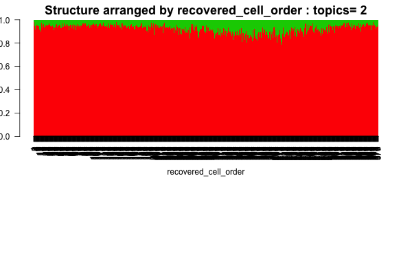
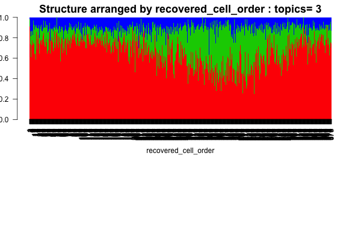
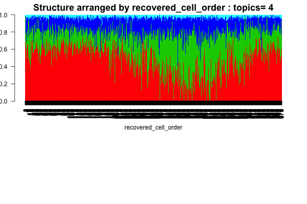
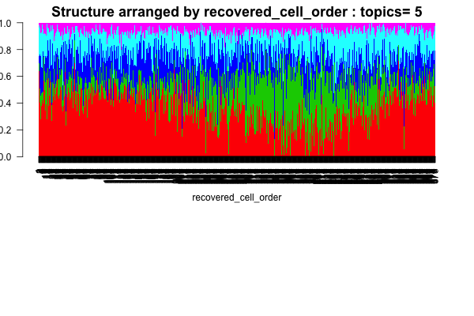

## Objective

In this script we follow the mechanism adopted by [Macosko et al](http://www.sciencedirect.com/science/article/pii/S0092867415005498) to recover the order of the cells in the single cell Seq experiment and then we build the heatmap and Structure plots of the single cells in the iPSC experiment following the ordering of the cells obtained.

```{r packages, echo=FALSE, eval=TRUE, message=FALSE, warning=FALSE}
rm(list=ls())
setwd('/Users/kushal/Documents/singleCell-method/project/analysis/')
library(CountClust)
library(data.table)
library(maptpx)
library(gplots)
library(philentropy)
library(dplyr)
library(edgeR)
library(qtlcharts)
library(limma)
```

## Preparing the Data

```{r data_prep, echo=TRUE, eval=TRUE}

reads <- data.frame(fread('../data/reads.txt'),row.names=1);
molecules <-  data.frame(fread('../data/molecules.txt'),row.names=1);

quality_single_cells <- scan("../data/quality-single-cells.txt",
                             what = "character")
anno <- data.frame(fread('../data/annotation.txt'));

molecules <- molecules[, grepl("bulk", colnames(molecules)) |
                         colnames(molecules) %in% quality_single_cells]
anno <- anno[anno$well == "bulk" | anno$sample_id %in% quality_single_cells, ]
stopifnot(ncol(molecules) == nrow(anno),
          colnames(molecules) == anno$sample_id)

reads <- reads[, grepl("bulk", colnames(reads)) |
                         colnames(reads) %in% quality_single_cells]
stopifnot(ncol(reads) == nrow(anno),
          colnames(reads) == anno$sample_id)

expressed <- rowSums(molecules[, anno$well == "bulk"]) > 0 &
             rowSums(molecules[, anno$well != "bulk"]) > 0
molecules <- molecules[expressed, ]

expressed <- rowSums(reads[, anno$well == "bulk"]) > 0 &
             rowSums(reads[, anno$well != "bulk"]) > 0
reads <- reads[expressed, ]

molecules_single <- molecules %>% select(-contains("bulk"))
reads_single <- reads %>% select(-contains("bulk"))

## Remove ERCC genes and genes with max molecule numer larger than 1024

ii_nonERCC <- grep("ERCC", rownames(molecules_single), invert = TRUE)

molecules_single <- molecules_single[ii_nonERCC,];

ii_notOverexpressed <- apply(molecules_single, 2, function(x) any(x < 1024) )

molecules_single <- molecules_single[ii_notOverexpressed,];

dim(molecules_single)
```

## Cell cycle gene extraction and cell phases

```{r cell_phase, echo=TRUE, eval=TRUE}
cell_cycle_genes <- read.table("../data/cellcyclegenes.txt", header = TRUE, sep="\t")

## create 5 lists of 5 phases (de-level and then remove "")
cell_cycle_genes_list <- lapply(1:5,function(x){
  temp <- as.character(cell_cycle_genes[,x])
  temp[temp!=""]
})

labs=unique(unlist(lapply(1:5, function(k) match(cell_cycle_genes_list[[k]],rownames(molecules_single)))));
labs = labs[!is.na(labs)];
molecules_single_cell_cycle <- molecules_single[labs,];
ans <-
sapply(cell_cycle_genes_list,function(xx){
  #### create table of each phase
  reads_single_phase <- reads_single[rownames(reads_single) %in% unlist(xx) ,]
  #### add average expression of all genes in the phase
  combined_matrix <- rbind(reads_single_phase,average=apply(reads_single_phase,2,mean))
  #### use transpose to compute cor matrix
  cor_matrix <- cor(t(combined_matrix))
  #### take the numbers
  cor_vector <- cor_matrix[,dim(cor_matrix)[1]]
  #### restrict to correlation >= 0.3 
  reads_single_phase_restricted <- reads_single_phase[rownames(reads_single_phase) %in% names(cor_vector[cor_vector >= 0.3]),]
  #### apply normalization to reads
  norm_factors_single <- calcNormFactors(reads_single_phase_restricted, method = "TMM")
  reads_single_cpm <- cpm(reads_single_phase_restricted, log = TRUE,
                            lib.size = colSums(reads_single) * norm_factors_single)
  #### output the phase specific scores (mean of normalized expression levels in the phase)
  apply(reads_single_cpm,2,mean)

})

#### normalization function
flexible_normalization <- function(data_in,by_row=TRUE){
  if(by_row){
    row_mean <- apply(data_in,1,mean)
    row_sd   <- apply(data_in,1,sd)
    output <- data_in
    for(i in 1:dim(data_in)[1]){
      output[i,] <- (data_in[i,] - row_mean[i])/row_sd[i]
    }
  }
  #### if by column
  if(!by_row){
    col_mean <- apply(data_in,2,mean)
    col_sd   <- apply(data_in,2,sd)
    output <- data_in
    for(i in 1:dim(data_in)[2]){
      output[,i] <- (data_in[,i] - col_mean[i])/col_sd[i]
    }
  }
  output
}

#### apply the normalization function
## first normalized for each phase
ans_normed <- flexible_normalization(ans,by_row=FALSE)
## then normalized of each cell
ans_normed_normed <- flexible_normalization(ans_normed,by_row=TRUE)

colnames(ans_normed_normed) <- c("G1.S", "S", "G2.M", "M", "M.G1");

cell_phase <- apply(ans_normed_normed,1,function(x) colnames(cell_cycle_genes)[which.max(x)])
assign_cell_phase <- data.frame(cell_phase)
cell_phase_vector <- as.vector(as.matrix(assign_cell_phase));
cell_phase_vector <- factor(cell_phase_vector, 
                            levels = c("G1.S", "S", "G2.M", "M", "M.G1"))


```


### Define the pattern matrices

```{r patterns, echo=TRUE, eval=TRUE}
patterns <- matrix(0,9,5);
for(m in 1:(nrow(patterns)))
{
  if(m%%2!=0) patterns[m,ceiling(m/2)]=1
  else{
  patterns[m,ceiling(m/2)]=1;
  patterns[m,ceiling(m/2)+1]=1;
  }
}

```

### Correlation Measure classification

```{r cell_assignment, echo=TRUE, eval=TRUE, warnings=FALSE, message=FALSE}

cor_across_patterns <- do.call(rbind,lapply(1:dim(ans_normed_normed)[1],function(x)
                           {
                                temp <- ans_normed_normed[x,];
                                cor_val <- array(0,dim(patterns)[1]);
                                for(i in 1:dim(patterns)[1])
                                {
                                  cor_val[i] <- cor(temp,patterns[i,]);
                                }
                                return(cor_val)
                           }))

cell_assign <- apply(cor_across_patterns, 1, which.max);
cell_names <- rownames(ans_normed_normed)
cell_split <- split(cell_names, cell_assign)
indices_split <- split(1:length(cell_names), cell_assign)

cell_order_list <- unlist(lapply(1:length(indices_split), function(l)
                                                {
                                                      if(l==1) {
                                                       indices <- indices_split[[l]];
                                                       measure <-cor_across_patterns[indices,l+1];
                                                        out <- cell_split[[l]][order(measure,decreasing=FALSE)];
                                                        return(out)
                                                    } else if(l==length(indices_split)) { 
                                                     indices <- indices_split[[l]];
                                                       measure <-cor_across_patterns[indices,l-1];
                                                       out <- cell_split[[l]][order(measure,decreasing=TRUE)];
                                                        return(out)
                                                   }  else {
                                                       indices <- indices_split[[l]];
                                                       measure <-(cor_across_patterns[indices,l+1])/(cor_across_patterns[indices,l-1]);
                                                      out <- cell_split[[l]][order(measure,decreasing=FALSE)];
                                                      return(out)
                                                  }
                                                }))

cell_order_list <- cbind.data.frame(cell_order_list)
colnames(cell_order_list) <- c("recovered_cell_order");
#write.table(cell_order_list,"../data/ipsc_ordered_cells.txt");


```

## Structure arranged by cell order (cellcycle/ batch effect corrected)

```{r structure_ordered, echo=TRUE, eval=TRUE}

nclus_vec <- 2:5
ipsc_topics_single <- get(load("../../project/rdas/topic_fit_ipsc_batchcorrect_cellcycle.rda"));

samp_metadata <- cbind.data.frame(1:dim(cell_order_list)[1]);
colnames(samp_metadata) <- c("recovered_cell_order")

cell_names <- rownames(ipsc_topics_single[[1]]$omega)


for(num in 1:length(nclus_vec))
{
doc_ordered <- ipsc_topics_single[[num]]$omega[match(as.vector(cell_order_list[,1]),cell_names),];
# barplot(t(doc_ordered),col=2:(nclus_vec[num]+1),axisnames=F,space=0,border=NA,
#            main=paste("Structure arranged by",colnames(samp_metadata)[num],": topics=",nclus_vec[num]),
#            las=las,ylim=c(0,1),ylab="admix prop", xlab=paste0(colnames(samp_metadata)[num]),
 #           cex.axis=cex.axis,cex.main=cex.main);
obj <- StructureObj_omega(doc_ordered, samp_metadata = samp_metadata, batch_lab = NULL,partition = rep("FALSE",dim(samp_metadata)[2]),path_struct='../figures/ipsc_structure_batchcorrect_cellcycle/',control=list(cex.axis=1));

}


```

### Structure plot by cell recovered order





