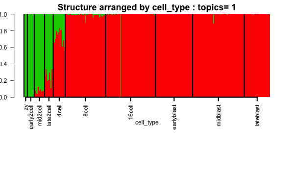
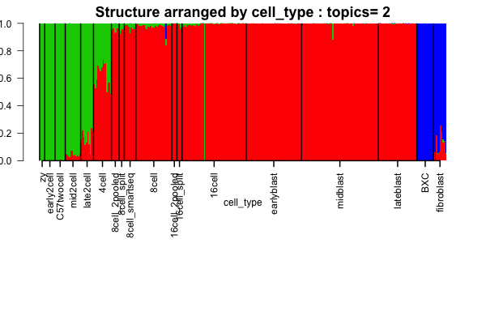
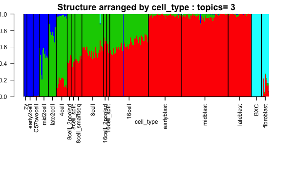
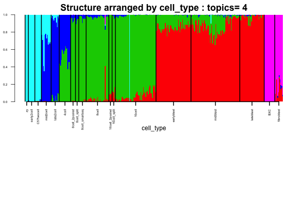
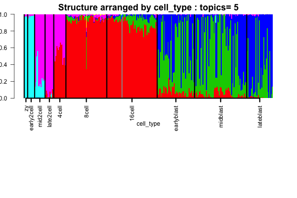
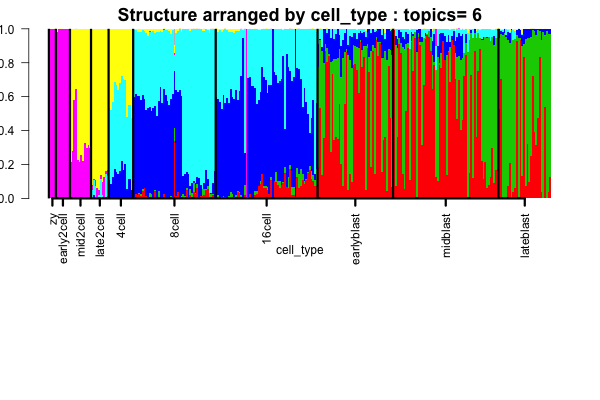

## Objective

The Deng dataset has single cells sequenced starting from zygote through the 2 cell, 4 cell all the way up to blastocyst. We want to cluster the development phase and try to see which genes are actually driving the clusters in the development phase. These would be the genes that would also play a significant part in differentiating the various stages of the development.


```{r echo=TRUE, eval=TRUE, warning=FALSE, message=FALSE}
rm(list=ls())
library(data.table)
#install_github('kkdey/maptpx') otherwise shows error
library(maptpx)
library(CountClust)
```


## Prepare the Data

```{r echo=TRUE, eval=FALSE}
rm(list=ls())
library(data.table)
library(CountClust)
setwd('/Users/kushal/Documents/singleCell-method/project/analysis/')

files <- list.files("../data/Deng_data/");

num <- 1
temp_data <- data.frame(fread(paste0('../data/Deng_data/',files[num])));
gene_names <- temp_data$X.Gene_symbol;

reads_mat <- cbind.data.frame(gene_names);

for(num in 1:length(files))
{
  temp_data <- data.frame(fread(paste0('../data/Deng_data/',files[num])));
  reads_mat <- cbind.data.frame(reads_mat,temp_data$reads);
}

cell_meta <- unlist(lapply(files, function(x) strsplit(x,"_")[[1]][2]));
colnames(reads_mat) <- c("gene_names",files);
reads_no_dups <- reads_mat %>%
                  group_by(gene_names) %>%
                  summarise_each(funs(sum))

reads_no_dups <- data.frame(reads_no_dups)

gene_names_new <- reads_no_dups[,1]
reads_no_dups <- reads_no_dups[,-1];
rownames(reads_no_dups) <- gene_names_new;
colnames(reads_no_dups) <- cell_meta;
dim(reads_no_dups);


write.table(reads_no_dups,"../data/Deng_cell_data.txt");
```

Now we load the data.

```{r echo=TRUE, eval=TRUE}
reads <- data.frame(fread('../data/Deng_cell_data.txt'),row.names=1);
files <- list.files("../data/Deng_data/");
cell_meta <- unlist(lapply(files, function(x) strsplit(x,"_")[[1]][2]));
cell_meta[grep("zy",cell_meta)]="zy";
cell_meta[grep("smartseq2", files)]="8cell_smartseq";
cell_meta[grep("8cell_2pooled", files)]="8cell_2pooled";
cell_meta[grep("8cell_split", files)]="8cell_split";
cell_meta[grep("16cell_2pooled", files)]="16cell_2pooled";
cell_meta[grep("16cell_split", files)]="16cell_split";

cell_meta_unique <- c("zy","early2cell","C57twocell","mid2cell","late2cell","4cell","8cell_2pooled","8cell_split","8cell_smartseq","8cell","16cell_2pooled","16cell_split","16cell","earlyblast","midblast","lateblast","BXC","fibroblast") ;
order_of_development <- order(match(cell_meta,cell_meta_unique))
#reads <- reads[,order(match(cell_meta,cell_meta_unique))];
cell_meta <- cell_meta[order(match(cell_meta,cell_meta_unique))]
colnames(reads) <- cell_meta;
```

## Fitting the admixture model

```{r echo=TRUE, eval=TRUE, warning=FALSE, message=FALSE}
samp_metadata <- cbind.data.frame(cell_meta);
counts <- t(reads);
colnames(samp_metadata) <- c("cell_type");

if(!dir.exists("../figures/deng_structure")) dir.create("../figures/deng_structure")

nclus_vec <- 2:7;

if(file.exists("../../project/rdas/deng_topic_fit.rda")) {
deng_topics <- get(load("../../project/rdas/deng_topic_fit.rda"));
} else {
StructureObj(as.matrix(counts),nclus_vec,samp_metadata = samp_metadata, tol=10, batch_lab = NULL, path_rda="../../project/rdas/deng_topic_fit.rda",partition=c('TRUE'),path_struct = "../figures/deng_structure");
deng_topics <- get(load("../../project/rdas/deng_topic_fit.rda"));
}


path_struct = "../figures/deng_structure"

num <- 1
metadata <- samp_metadata[,num];
deng_topics <- get(load("../../project/rdas/deng_topic_fit.rda"));

for(nclus in 1:length(nclus_vec)){
  
docweights <- deng_topics[[nclus]]$omega[order_of_development,];

 if(!dir.exists(paste0(path_struct,"/clus_",dim(docweights)[2])))
    dir.create(paste0(path_struct,"/clus_",dim(docweights)[2]))

control.default <- list(struct.width=600, struct.height=400, cex.axis=1, cex.main=1.5, las=2, lwd=2,mar.bottom =14, mar.left=2, mar.top=2, mar.right=2,color=2:(dim(docweights)[2]+1));
control <- control.default;
struct.width <- control$struct.width;
struct.height <- control$struct.height;
cex.axis <- control$cex.axis;
cex.main <- control$cex.main;
las <- control$las;
lwd <- control$lwd;
mar.bottom <- control$mar.bottom;
mar.left <- control$mar.left;
mar.top <- control$mar.top;
mar.right <- control$mar.right;
color <- control$color;

png(filename=paste0(path_struct,'/clus_',dim(docweights)[2],'/struct_clus_',dim(docweights)[2],'_',colnames(samp_metadata)[num],'.png'),width=struct.width, height=struct.height);
    par(mar=c(mar.bottom,mar.left, mar.top,mar.right))
    barplot(t(docweights),col=color,axisnames=F,space=0,border=NA,
            main=paste("Structure arranged by",colnames(samp_metadata)[num],": topics=",nclus),
            las=las,ylim=c(0,1),ylab="admix prop", xlab=paste0(colnames(samp_metadata)[num]),
            cex.axis=cex.axis,cex.main=cex.main);
    labels = match(unique(metadata), metadata);
    abline(v=labels-1, lty=1, lwd=lwd)

    labels_low=labels-1;
    labels_up=c(labels_low[2:length(labels_low)],dim(docweights)[1]);
    mid_point <- labels_low +0.5*(labels_up-labels_low);
    axis(1,at=mid_point, unique(metadata),las=las,cex.axis=cex.axis,lwd=lwd);
dev.off()
}
    

```


### Structur based on cell type

The Structure plots clearly show cell phase effects








## Observation from Structure

Admixture indeed picks up the different developing phases. Zygote and early 2 cells fall in same cluster, but difference creeps in from mid 2 cell. There is a continuous pattern on admixture as one moves from 2 cell to 4 cell and even further from 8 cell to 16 cell. Blastocysts however form a separate cluster as is expected and the variation across the different stages of blastocyst, for instance, early, mid or late blastocysts show more or less similar patterns (late blastocyst is slightly different from the other two). In the dataset, we also had BxC liver cells and fibroblasts which separate out from the other single cells.


```{r}
sessionInfo()
