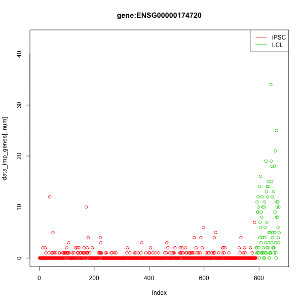
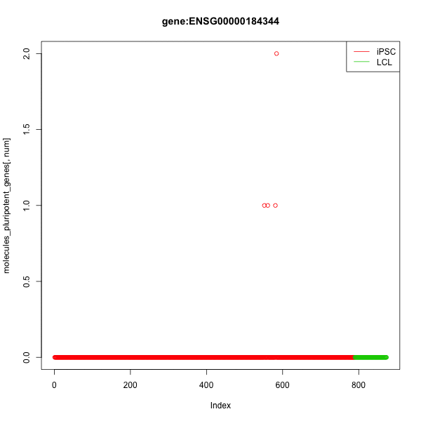
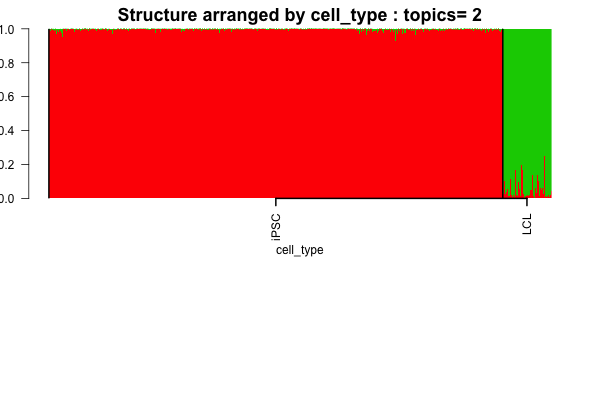
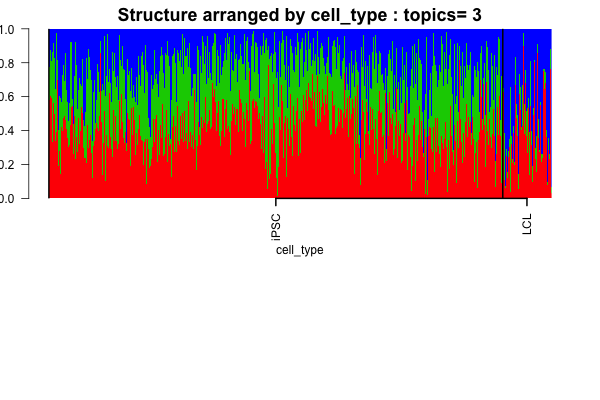
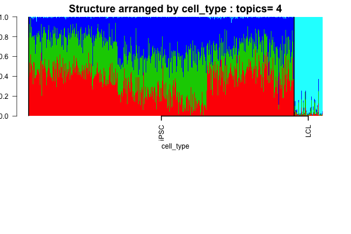
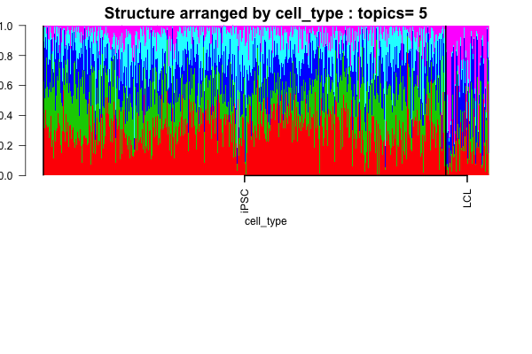

  
```{r echo=FALSE, eval=TRUE}
rm(list=ls())
```

```{r echo=TRUE, eval=TRUE}
library(CountClust)
suppressMessages(library(mygene))
library(knitr)
suppressMessages(library(data.table))
library(animation)
ani.options(interval = 0.5, nmax = 100)


```

## Objective

In this script, we compare the patterns of expression of the cluster driving genes across the iPSCs and LCLs. We also extract the pluripotency genes and observe the patterns of relative expression of the genes between the iPSCs and the LCLs.

## Extracting cluster driving genes 

```{r echo=TRUE, eval=TRUE}
setwd('/Users/kushal/Documents/singleCell-method/project/analysis')

ipsc_lcl_topics <- get(load("../../project/rdas/topic_fit_ipsc_lcl.rda"));

theta <- ipsc_lcl_topics[[1]]$theta;
features <- ExtractTopFeatures(theta,top_features=30,method="poisson")

features_vec <- unique(as.vector(features));

class <- as.numeric(apply(theta[features_vec,], 1, which.max))

imp_gene_names <- rownames(theta[features_vec,]);

imp_genes_per_class <- lapply(1:dim(theta)[2], function(x) imp_gene_names[which(class==x)]);

```

We now consider the expression patterns for these selected genes which are the top genes driving the iPSC and LCL clustering.

```{r echo=TRUE, eval=TRUE}

molecules_single_pooled <- data.frame(fread('../data/molecules-ipsc-lcl-single.txt'))[,-1];

data_imp_genes <- molecules_single_pooled[,features_vec];
```

We use the following animation of these genes and their variation across the iPSCs and the LCLs. There are 84 LCLs and there are 789 iPSCs. 

## Reads expression profile of driving genes

```{r clock, fig.width=7, fig.height=6, fig.show="animate"}

suppressMessages(saveGIF(
for (num in 1:dim(data_imp_genes)[2])
{
  plot(data_imp_genes[,num],col=c(rep(2,789),rep(3,84)),main=paste0("gene:",imp_gene_names[num]));
  legend("topright",c('iPSC','LCL'),col=2:3,lty=c(1,1));
}, movie.name="imp_gene_patterns_ipsc_lcl.gif", interval = 0.5, nmax = 30, ani.width = 600, ani.height = 600))

```



It seems pretty clear that these genes indeed have a difference in expression patterns between the iPSc and the LCL cell lines. 


## Pluripotency genes extraction

Now we consider a case study of the pluripotent genes. These are the genes which are expected to show a difference in expression patterns between the LCL and the iPSCs.

```{r echo=TRUE, eval=TRUE}
pluripotency_genes <- read.table("../data/pluripotency-genes.txt", header = TRUE, sep="\t")

pluripotency_gene_names <- pluripotency_genes[,2];
labs <- match(as.character(pluripotency_gene_names),rownames(theta))
labs <- labs[which(!is.na(labs))];

theta_pluripotent <- theta[labs,];

pluripotency_gene_names <- pluripotency_gene_names[which(!is.na(labs))];

```

The relative expression profile of the pluripotency genes in the two clusters are given by 

```{r }
kable(theta_pluripotent)
```

We plot the logarithm of the theta values for the two clusters for all the pluripotent genes and plot the scatter plot of the genes.

We plot next the log of the ratio of the theta value for the iPSC and the theta value for the LCL.

```{r}
plot(log(theta_pluripotent[,1]/theta_pluripotent[,2]),lwd=1,pch=20,cex=1)

```

Most of the pluripotency genes show very high expression profile or theta values for the iPSC compared to the LCL. 

## Reads expression profile of pluripotency genes

Now we look at the reads expression profile for the pluripotency genes.

```{r, echo=TRUE, eval=TRUE}

molecules_pluripotent_genes <- molecules_single_pooled[,labs];
suppressMessages(saveGIF(
for (num in 1:length(labs))
{
  plot(molecules_pluripotent_genes[,num],col=c(rep(2,789),rep(3,84)),main=paste0("gene:",pluripotency_gene_names[num]));
  legend("topright",c('iPSC','LCL'),col=2:3,lty=c(1,1));
}, movie.name="pluripotent_gene_patterns_ipsc_lcl.gif", interval = 0.5, nmax = 30, ani.width = 600, ani.height = 600))


```




## Admixture model on pluripotent genes 

```{r echo=TRUE, eval=TRUE}

samp_metadata <- cbind.data.frame(c(rep("iPSC",789),rep("LCL",84)));
names(samp_metadata)="cell_type"

if(!dir.exists("../figures/ipsc_lcl_pluripotent_genes_structure")) dir.create("../figures/ipsc_lcl_pluripotent_genes_structure")

nclus_vec <- 2:5;

if(file.exists("../../project/rdas/topic_fit_ipsc_lcl_pluripotent_genes.rda")) {
ipsc_lcl_pluripotent_genes_topics <- get(load("../../project/rdas/topic_fit_ipsc_lcl_pluripotent_genes.rda"));
} else {
StructureObj(as.matrix(molecules_pluripotent_genes),nclus_vec,samp_metadata = samp_metadata, tol=0.005, batch_lab = NULL, path_rda="../../project/rdas/topic_fit_ipsc_lcl_pluripotent_genes.rda",path_struct = "../figures/ipsc_lcl_pluripotent_genes_structure");
ipsc_lcl_pluripotent_genes_topics <- get(load("../../project/rdas/topic_fit_ipsc_lcl_pluripotent_genes.rda"));
}

for(num in 1:length(nclus_vec))
{
obj <- StructureObj_omega(ipsc_lcl_pluripotent_genes_topics[[num]]$omega, samp_metadata = samp_metadata, batch_lab = NULL,partition = rep("TRUE",dim(samp_metadata)[2]),path_struct='../figures/ipsc_lcl_pluripotent_genes_structure',control=list(cex.axis=1));
}


```

The admixture plots are provided as follows 





