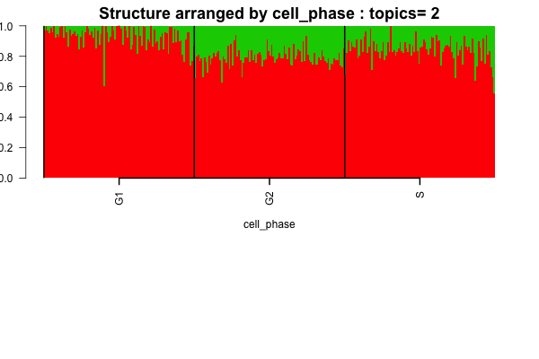
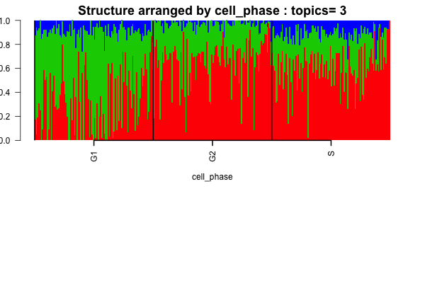
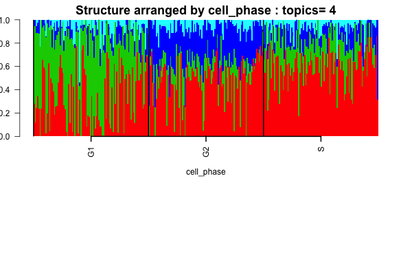

## Objective

In this script, we perform clustering on the single cell data obtained from Marioni and try to see if we see any cell cycle specific patterns.

## Data Preparation

```{r echo=FALSE, eval=TRUE, warning=FALSE, message=FALSE}
library(data.table)
library(maptpx)
library(CountClust)
```

```{r data, echo=TRUE, eval=TRUE}
setwd('/Users/kushal/Documents/singleCell-method/project/analysis/')
G1_single <- data.frame(fread('../data/Marioni_data/G1_singlecells_counts.txt'), row.names=1);
G2M_single <- data.frame(fread('../data/Marioni_data/G2M_singlecells_counts.txt'), row.names=1);
S_single <- data.frame(fread('../data/Marioni_data/S_singlecells_counts.txt'), row.names=1);

```

We remove the ERCC genes. Plus we separate out the Ensembl Transcript ID, the associate gene name and the length of the gene.  It seems there were 96 cells in each phase. Was it because they used the same plate for all the cells obtained from FACS sorting. 

```{r ercc_remove, echo=TRUE, eval=TRUE}

ercc_start <- grep("ERCC", rownames(G1_single))[1]

G1_single <- G1_single[-(ercc_start:dim(G1_single)[1]),-(1:3)];
G2M_single <- G2M_single[-(ercc_start:dim(G2M_single)[1]),-(1:3)];
S_single <- S_single[-(ercc_start:dim(S_single)[1]),-(1:3)];
```

Now we pool the data from the three phases.

```{r pooled_data, echo=TRUE, eval=TRUE}

pooled_data <- t(cbind(G1_single, G2M_single, S_single));
```


## Structure model

Now we apply the Structure plot

```{r structure_pooled, echo=TRUE, eval=TRUE}
samp_metadata <- cbind.data.frame(c(rep("G1",96),rep("G2",96),rep("S",96)));
colnames(samp_metadata) <- c("cell_phase");

if(!dir.exists("../figures/marioni_structure")) dir.create("../figures/marioni_structure")

nclus_vec <- 2:5;

if(file.exists("../../project/rdas/marioni_pooled_topic_fit.rda")) {
marioni_topics <- get(load("../../project/rdas/marioni_pooled_topic_fit.rda"));
} else {
StructureObj(pooled_data,nclus_vec,samp_metadata = samp_metadata, tol=0.005, batch_lab = NULL, path_rda="../../project/rdas/marioni_pooled_topic_fit.rda",partition=c('TRUE'),path_struct = "../figures/marioni_structure");
marioni_topics <- get(load("../../project/rdas/marioni_pooled_topic_fit.rda"));
}

for(num in 1:length(nclus_vec))
{
obj <- StructureObj_omega(marioni_topics[[num]]$omega, samp_metadata = samp_metadata, batch_lab = NULL,partition = rep("TRUE",dim(samp_metadata)[2]),path_struct="../figures/marioni_structure",control=list(cex.axis=1));
}
  
```

The Structure plots clearly show cell phase effects






