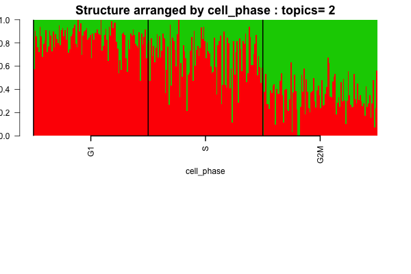
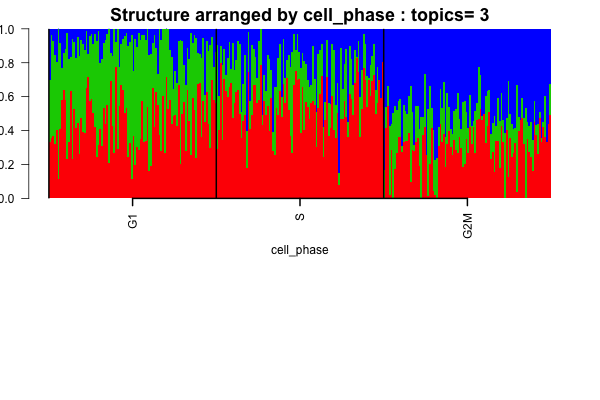
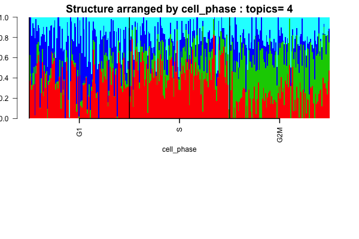
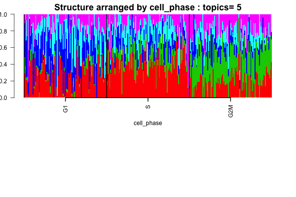

## Objective

In this script, we perform clustering on the single cell data obtained from Marioni and try to see if we see any cell cycle specific patterns.

## Data Preparation

```{r echo=FALSE, eval=TRUE, warning=FALSE, message=FALSE}
setwd('/Users/kushal/Documents/singleCell-method/project/analysis/')
library(data.table)
library(maptpx)
library(CountClust)
library(readxl)
```

```{r data, echo=TRUE, eval=TRUE}
setwd('/Users/kushal/Documents/singleCell-method/project/analysis/')
G1_single <- data.frame(fread('../data/Marioni_data/G1_singlecells_counts.txt'), row.names=1);
G2M_single <- data.frame(fread('../data/Marioni_data/G2M_singlecells_counts.txt'), row.names=1);
S_single <- data.frame(fread('../data/Marioni_data/S_singlecells_counts.txt'), row.names=1);

```

We remove the ERCC genes. Plus we separate out the Ensembl Transcript ID, the associate gene name and the length of the gene.  It seems there were 96 cells in each phase. Was it because they used the same plate for all the cells obtained from FACS sorting. 

```{r ercc_remove, echo=TRUE, eval=TRUE}

ercc_start <- grep("ERCC", rownames(G1_single))[1]

G1_single <- G1_single[-(ercc_start:dim(G1_single)[1]),-(1:3)];
G2M_single <- G2M_single[-(ercc_start:dim(G2M_single)[1]),-(1:3)];
S_single <- S_single[-(ercc_start:dim(S_single)[1]),-(1:3)];
```

Now we pool the data from the three phases.

```{r pooled_data, echo=TRUE, eval=TRUE}

pooled_data <- t(cbind(G1_single, S_single, G2M_single));
```

## Extracting the data

Extracting the cell cycle data

```{r echo=TRUE, eval=TRUE}
cell_cycle_genes <- as.vector(as.matrix((read_excel('../data/Marioni_data/cellcycle_genes_mouse.xlsx'))))

matched_indices <- match(cell_cycle_genes,colnames(pooled_data))
cycle_counts_data <- pooled_data[,matched_indices];
cycle_counts_data <- cycle_counts_data[, -which(colSums(cycle_counts_data)==0)]
library(limma)
cycle_voom_data <- voom(cycle_counts_data)$E;
library(scales)
cycle_data <- apply(cycle_voom_data,2, function(x) rescale(x, to=c(-1,1)));
cell_phase_vector <- c(rep("G1", 96), rep("S", 96), rep("G2M", 96))

```

## Admixture on cell cycle data

```{r structure_cellcycle, echo=TRUE, eval=TRUE}
samp_metadata <- cbind.data.frame(factor(c(rep("G1",96),rep("S",96),rep("G2M",96)),levels=c("G1","S","G2M"),ordered=TRUE));
colnames(samp_metadata) <- c("cell_phase");

if(!dir.exists("../figures/marioni_structure_cellcycle")) dir.create("../figures/marioni_structure_cellcycle")

nclus_vec <- 2:5;

if(file.exists("../../project/rdas/marioni_pooled_topic_fit_cellcycle.rda")) {
marioni_topics_cellcycle <- get(load("../../project/rdas/marioni_pooled_topic_fit_cellcycle.rda"));
} else {
StructureObj(cycle_counts_data,nclus_vec,samp_metadata = samp_metadata, tol=0.005, batch_lab = NULL, path_rda="../../project/rdas/marioni_pooled_topic_fit_cellcycle.rda",partition=c('TRUE'),path_struct = "../figures/marioni_structure_cellcycle");
marioni_topics_cellcycle <- get(load("../../project/rdas/marioni_pooled_topic_fit_cellcycle.rda"));
}

for(num in 1:length(nclus_vec))
{
obj <- StructureObj_omega(marioni_topics_cellcycle[[num]]$omega, samp_metadata = samp_metadata, batch_lab = NULL,partition = rep("TRUE",dim(samp_metadata)[2]),path_struct="../figures/marioni_structure_cellcycle",control=list(cex.axis=1));
}
  
```

The Structure plots clearly show cell phase effects






## qtlcharts for cell cycle genes - normalized

We apply qtlcharts plot on cell cycle data rescaled to -1 to 1 (in Oscope paper, they did this rescaling before applying sinusoidal model because they wanted to get rid of the amplitudes).

### First 100 genes from cell cycle genes file 

```{r echo=TRUE, eval=TRUE}
library(qtlcharts)
iplotCurves(t(cycle_data[,1:100]))
```

### Next 100 genes from cell cycle genes file 

```{r echo=TRUE, eval=TRUE}
library(qtlcharts)
iplotCurves(t(cycle_data[,1:100]))
```

### Top 100 genes from cluster annotations (Admixture)

We then extract the top $100$ cell cycle genes from the cluster annotations for $K=3$ and we present the qtlcharts for these cell cycle genes.

```{r echo=TRUE, eval=TRUE}

theta <- marioni_topics_cellcycle[[2]]$theta;
features <- ExtractTopFeatures(theta,top_features=50,method="poisson")
features_vec <- unique(as.vector(features));
counts_top_features <- cycle_data[,features_vec];
iplotCurves(t(counts_top_features))

```


## qtlcharts for cell cycle genes - non-normalized

### First 100 genes from cell cycle genes file

```{r echo=TRUE, eval=TRUE}
library(qtlcharts)
iplotCurves(t(cycle_counts_data[,1:100]))
```

### Next 100 genes from cell cycle genes file 

```{r echo=TRUE, eval=TRUE}
library(qtlcharts)
iplotCurves(t(cycle_counts_data[,1:100]))
```

### Top 100 genes from cluster annotations (Admixture)

We then extract the top $100$ cell cycle genes from the cluster annotations for $K=3$ and we present the qtlcharts for these cell cycle genes.

```{r echo=TRUE, eval=TRUE}

theta <- marioni_topics_cellcycle[[2]]$theta;
features <- ExtractTopFeatures(theta,top_features=50,method="poisson")
features_vec <- unique(as.vector(features));
counts_top_features <- cycle_counts_data[,features_vec];
iplotCurves(t(counts_top_features))

```

