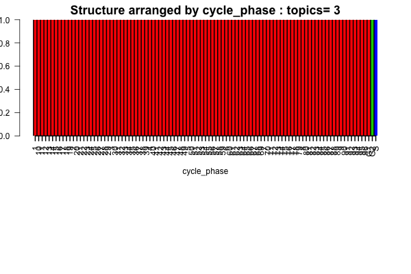
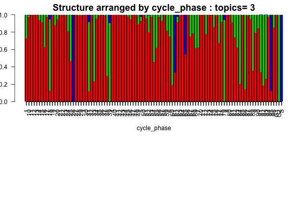

## Overview

In this script, we apply the `classtpx` model for classification of the datasets in Scialdone et al (2015), check [paper](http://www.sciencedirect.com/science/article/pii/S1046202315300098). The datasets used in this script are E-MTAB-3749 (FACS sorted data on G1, G2 and S cells) and  E-MTAB-3707 (liver data). 

## Data reading 

```{r echo=TRUE, eval=TRUE, warning=FALSE, message=FALSE}
library(data.table)
G1_data <- read.table("../data/Scialdone2015data/G1_htseq_count.txt");
G2M_data <- read.table("../data/Scialdone2015data/G2M_htseq_count.txt");
S_data <- read.table("../data/Scialdone2015data/S_htseq_count.txt");

liver_data <- data.frame(fread("../data/Scialdone2015data/Marioni_lab_1_Jul_2015_gene_counts_table.txt"));

facs_data <- cbind.data.frame(G1_data[,1], G1_data[,2], G2M_data[,2], S_data[,2]);
colnames(facs_data) <- c("genes", "G1.counts", "G2M.counts", "S.counts");

indices_intersect <- intersect(facs_data[,1], liver_data[,1])

matched_liver <-  match(indices_intersect, liver_data[,1])
liver_data_mod <- liver_data[matched_liver,-1];
rownames(liver_data_mod) <- indices_intersect;

matched_facs <- match(indices_intersect, facs_data[,1])
facs_data_mod <- facs_data[matched_facs,-1];
rownames(facs_data_mod) <-  indices_intersect;

data_mod <- cbind(facs_data_mod, liver_data_mod);

counts <- t(data_mod);
is.na(ercc_start <- grep("ERCC", rownames(data_mod))[1])
```

## Classtpx model fit

Now we apply the `classtpx` model fixing the first three rows to the cell types $G1$, $G2M$ and $S$. 

```{r echo=TRUE, eval=TRUE}
library(classtpx)
K <- 3;
known_indices <- 1:3;
omega_known <- rbind(c(1,0,0), c(0,1,0), c(0,0,1));
Topic_clus <- classtpx::class_topics(counts, K, known_indices = known_indices, omega_known = omega_known, tol=0.001);

```


```{r structure_pooled, echo=TRUE, eval=TRUE}
samp_metadata <- cbind.data.frame(c("G1", "G2", "S", 1:96));
colnames(samp_metadata) <- c("cycle_phase");

if(!dir.exists("../figures/scialdone_structure")) dir.create("../figures/scialdone_structure")

library(CountClust)
obj <- StructureObj_omega(Topic_clus$omega, samp_metadata = samp_metadata, batch_lab = NULL,partition = rep("TRUE",dim(samp_metadata)[2]),path_struct="../figures/scialdone_structure",control=list(cex.axis=1));

  
```

The Structure plots clearly show cell phase effects



It was observed that the FACS data had $10^3$ times higher sequencing depth compared to the liver data which were used for classifying. So, in order to account for the difference in sequencing depth, we first thin the data.

## Analysis of thinned data

```{r echo=TRUE, eval=TRUE}
counts_thin_top_3 <- apply(counts[1:3,], c(1,2), function(x) rbinom(1,x,0.001))
counts_thin <- counts;
counts_thin[1:3,] <- counts_thin_top_3;
```

```{r echo=TRUE, eval=TRUE}
K <- 3;
known_indices <- 1:3;
omega_known <- rbind(c(1,0,0), c(0,1,0), c(0,0,1));
Topic_clus <- classtpx::class_topics(counts_thin, K, known_indices = known_indices, omega_known = omega_known, tol=0.001);

```


```{r structure_pooled_thin, echo=TRUE, eval=TRUE}
samp_metadata <- cbind.data.frame(c("G1", "G2", "S", 1:96));
colnames(samp_metadata) <- c("cycle_phase");

if(!dir.exists("../figures/scialdone_structure/thinned")) dir.create("../figures/scialdone_structure/thinned")

library(CountClust)
obj <- StructureObj_omega(Topic_clus$omega, samp_metadata = samp_metadata, batch_lab = NULL,partition = rep("TRUE",dim(samp_metadata)[2]),path_struct="../figures/scialdone_structure/thinned",control=list(cex.axis=1));

  
```

The Structure plots clearly show cell phase effects



## Observations

It is clear from the above Structure plot analysis that both with and without thinning, almost all of the liver cells seem to be classified in the phase G1 (except a few exceptions under thinned data). This is not
entirely surprising because most of the cells usually are in the growth phase. 

We perform PCA to see how closely the admixture results match with the PCA results. 

```{r echo=TRUE, eval=TRUE}
color <- c(2:4, rep(1, 96));
out_pca <- prcomp(counts);
plot(out_pca$x[,1], out_pca$x[,2], col=color, pch=c(rep(3,3), rep(20,96)))
legend("bottomright", c("G1","G2M", "S"), fill=c(2,3,4))
plot(out_pca$x[,2], out_pca$x[,3], col=color, pch=c(rep(3,3), rep(20,96)))
legend("topleft", c("G1","G2M", "S"), fill=c(2,3,4))
```
