## Objective

In this script, we consider the pooled data from iPSC and LCL and try to cluster them to see what patterns show up in the analysis. In this script, we shall consider throughout only the single cells from the iPSC study and the single cells from the LCL study and then apply the Structure model on the combined single cell level data from these two sources. 

```{r packages, echo=TRUE, eval=TRUE}
rm(list=ls())
setwd('/Users/kushal/Documents/singleCell-method/project/iPSC+LCL/src')
suppressMessages(suppressWarnings(library(CountClust)))
suppressMessages(suppressWarnings(library(data.table)))
suppressMessages(suppressWarnings(library(gplots)))
suppressMessages(suppressWarnings(library(philentropy)))
suppressMessages(suppressWarnings(library(dplyr)))
suppressMessages(suppressWarnings(library(edgeR)))
suppressMessages(suppressWarnings(library(qtlcharts)))
suppressMessages(suppressWarnings(library(limma)))
suppressMessages(suppressWarnings(library(readr)))

```

## Preparing the LCL data

```{r lcl_data, echo=TRUE, eval=TRUE}

lcl_qc_data <- read_csv("../data/qc-lcl.csv");
lcl_annotations <- read.table('../data/annotation-lcl.txt',header=TRUE);
lcl_molecules <- t(data.frame(fread('../data/molecules-lcl.txt'), row.names = 1));

lcl_indices <- match(lcl_qc_data$ll_name, lcl_annotations$well)

lcl_molecules_refined <- lcl_molecules[lcl_indices,];
lcl_annotations_refined <- lcl_annotations[lcl_indices,];

well_id <- lcl_annotations_refined$well;
ids <- sapply(well_id, function(x) substring(x,2,3))
lane_lab <- array(0, length(ids))
lane_lab[which(ids=="01" | ids=="02" | ids=="03")]=1;
lane_lab[which(ids=="04" | ids=="05" | ids=="06")]=2;
lane_lab[which(ids=="07" | ids=="08" | ids=="09")]=3;
lane_lab[which(ids=="10" | ids=="11" | ids=="12")]=4;


individual_lab_LCL <- paste0(lcl_annotations$individual[lcl_indices],"_","LCL");


lcl_single_cells <- lcl_molecules_refined[which(lcl_qc_data$cell.num==1),];
lane_lab_single_cells <- lane_lab[which(lcl_qc_data$cell.num==1)];
lane_lab_LCL <- paste0(lane_lab_single_cells,"_","LCL");
individual_lab_LCL <- individual_lab_LCL[which(lcl_qc_data$cell.num==1)];

reads_lcl <- data.frame(fread('../data/reads-lcl.txt'),row.names=TRUE);
reads_lcl <- reads_lcl[,lcl_indices];
reads_lcl_single <- reads_lcl[,which(lcl_qc_data$cell.num==1)];
reads_single <- as.matrix(reads_lcl_single)

cell_cycle_genes <- read.table("../data/cellcyclegenes.txt", header = TRUE, sep="\t")

## create 5 lists of 5 phases (de-level and then remove "")
cell_cycle_genes_list <- lapply(1:5,function(x){
  temp <- as.character(cell_cycle_genes[,x])
  temp[temp!=""]
})


ans <-
sapply(cell_cycle_genes_list,function(xx){
  #### create table of each phase
  reads_single_phase <- reads_single[rownames(reads_single) %in% unlist(xx) ,]
  #### add average expression of all genes in the phase
  combined_matrix <- rbind(reads_single_phase,average=apply(reads_single_phase,2,mean))
  #### use transpose to compute cor matrix
  cor_matrix <- cor(t(combined_matrix))
  #### take the numbers
  cor_vector <- cor_matrix[,dim(cor_matrix)[1]]
  #### restrict to correlation >= 0.3 
  reads_single_phase_restricted <- reads_single_phase[rownames(reads_single_phase) %in% names(cor_vector[cor_vector >= 0.3]),]
  #### apply normalization to reads
  norm_factors_single <- calcNormFactors(reads_single_phase_restricted, method = "TMM")
  reads_single_cpm <- cpm(reads_single_phase_restricted, log = TRUE,
                            lib.size = colSums(reads_single) * norm_factors_single)
  #### output the phase specific scores (mean of normalized expression levels in the phase)
  apply(reads_single_cpm,2,mean)

})

flexible_normalization <- function(data_in,by_row=TRUE){
  if(by_row){
    row_mean <- apply(data_in,1,mean)
    row_sd   <- apply(data_in,1,sd)
    output <- data_in
    for(i in 1:dim(data_in)[1]){
      output[i,] <- (data_in[i,] - row_mean[i])/row_sd[i]
    }
  }
  #### if by column
  if(!by_row){
    col_mean <- apply(data_in,2,mean)
    col_sd   <- apply(data_in,2,sd)
    output <- data_in
    for(i in 1:dim(data_in)[2]){
      output[,i] <- (data_in[,i] - col_mean[i])/col_sd[i]
    }
  }
  output
}

#### apply the normalization function
## first normalized for each phase
ans_normed <- flexible_normalization(ans,by_row=FALSE)
## then normalized of each cell
ans_normed_normed <- flexible_normalization(ans_normed,by_row=TRUE)

cell_phase <- apply(ans_normed_normed,1,function(x) colnames(cell_cycle_genes)[which.max(x)])
assign_cell_phase <- data.frame(cell_phase)

labs=unique(unlist(lapply(1:5, function(k) match(cell_cycle_genes_list[[k]],colnames(lcl_single_cells)))));
labs = labs[!is.na(labs)];
lcl_single_cell_cycle_genes <- lcl_single_cells[,labs];

molecules_single_LCL <- t(lcl_single_cells);

cell_phase_LCL <- paste0(as.vector(as.matrix(assign_cell_phase)),"_","LCL");

```

## Preparing the iPSC data

```{r ipsc, echo=TRUE, eval=TRUE}

ipsc_qc_data <- read.table("../data/qc-ipsc.txt",header=TRUE);
labs <- which(ipsc_qc_data$cell_number==1)

batch_lab_iPSC <- ipsc_qc_data$batch[labs];

well_id <- ipsc_qc_data$well[labs];
ids <- sapply(well_id, function(x) substring(x,2,3))
lane_lab <- array(0, length(ids))
lane_lab[which(ids=="01" | ids=="02" | ids=="03")]=1;
lane_lab[which(ids=="04" | ids=="05" | ids=="06")]=2;
lane_lab[which(ids=="07" | ids=="08" | ids=="09")]=3;
lane_lab[which(ids=="10" | ids=="11" | ids=="12")]=4;

lane_lab_iPSC <- paste0(lane_lab,"_","iPSC");

molecules_single <- data.frame(fread('../data/molecules.txt'),row.names=1);

qc_ids <- paste0("NA",ipsc_qc_data[,1],".",ipsc_qc_data[,2],".",ipsc_qc_data[,3]);

molecules_single <- molecules_single[,match(qc_ids,colnames(molecules_single))];

molecules_single_iPSC <- molecules_single[,labs];
individual_lab_iPSC <- ipsc_qc_data$individual[labs]

reads_single <- data.frame(fread('../data/reads.txt'),row.names=1);
reads_single <- reads_single[,labs];


ans <-
sapply(cell_cycle_genes_list,function(xx){
  #### create table of each phase
  reads_single_phase <- reads_single[rownames(reads_single) %in% unlist(xx) ,]
  #### add average expression of all genes in the phase
  combined_matrix <- rbind(reads_single_phase,average=apply(reads_single_phase,2,mean))
  #### use transpose to compute cor matrix
  cor_matrix <- cor(t(combined_matrix))
  #### take the numbers
  cor_vector <- cor_matrix[,dim(cor_matrix)[1]]
  #### restrict to correlation >= 0.3 
  reads_single_phase_restricted <- reads_single_phase[rownames(reads_single_phase) %in% names(cor_vector[cor_vector >= 0.3]),]
  #### apply normalization to reads
  norm_factors_single <- calcNormFactors(reads_single_phase_restricted, method = "TMM")
  reads_single_cpm <- cpm(reads_single_phase_restricted, log = TRUE,
                            lib.size = colSums(reads_single) * norm_factors_single)
  #### output the phase specific scores (mean of normalized expression levels in the phase)
  apply(reads_single_cpm,2,mean)

})

flexible_normalization <- function(data_in,by_row=TRUE){
  if(by_row){
    row_mean <- apply(data_in,1,mean)
    row_sd   <- apply(data_in,1,sd)
    output <- data_in
    for(i in 1:dim(data_in)[1]){
      output[i,] <- (data_in[i,] - row_mean[i])/row_sd[i]
    }
  }
  #### if by column
  if(!by_row){
    col_mean <- apply(data_in,2,mean)
    col_sd   <- apply(data_in,2,sd)
    output <- data_in
    for(i in 1:dim(data_in)[2]){
      output[,i] <- (data_in[,i] - col_mean[i])/col_sd[i]
    }
  }
  output
}

#### apply the normalization function
## first normalized for each phase
ans_normed <- flexible_normalization(ans,by_row=FALSE)
## then normalized of each cell
ans_normed_normed <- flexible_normalization(ans_normed,by_row=TRUE)

cell_phase <- apply(ans_normed_normed,1,function(x) colnames(cell_cycle_genes)[which.max(x)])
assign_cell_phase <- data.frame(cell_phase)

cell_phase_iPSC <- paste0(as.vector(as.matrix(assign_cell_phase)),"_","iPSC");

```

## Pooling LCL and iPSC cells

We now pool the LCL and the iPSC cells together

```{r pool_data, echo=TRUE, eval=TRUE}
molecules_single_pooled <- t(cbind(molecules_single_iPSC,molecules_single_LCL));
lane_lab_pooled <- c(lane_lab_iPSC,lane_lab_LCL);
indiv_lab_pooled <- c(individual_lab_iPSC, individual_lab_LCL);
batch_lab_pooled <- c(batch_lab_iPSC, rep("LCL",84));
cell_phase_pooled <- c(cell_phase_iPSC, cell_phase_LCL);

```


## All genes analysis

### Batch uncorrected model

Now we fit Structure model on the pooled data without batch-individual correction.

```{r echo=TRUE, eval=TRUE}

batch_indiv_pooled <- paste0(indiv_lab_pooled,".",batch_lab_pooled);
samp_metadata <- cbind.data.frame(indiv_lab_pooled, lane_lab_pooled, batch_lab_pooled, cell_phase_pooled, batch_indiv_pooled);
colnames(samp_metadata) = c("individual", "lane", "batch", "cell_phase", "indiv.batch");
if(!dir.exists("Structure/batch_uncorrected_single")) dir.create("Structure/batch_uncorrected_single")

nclus_vec <- 2:5;

#StructureObj(molecules_single_pooled,nclus_vec,samp_metadata = samp_metadata, tol=0.001, batch_lab = NULL, path_rda="../../../project/rdas/topic_fit_ipsc_lcl.rda",partition=c('TRUE'),path_struct = NULL);

ipsc_lcl_topics <- get(load("../../../project/rdas/topic_fit_ipsc_lcl.rda"));

if(!dir.exists("../../figures/ipsc_lcl_structure")) dir.create("../../figures/ipsc_lcl_structure")

for(num in 1:length(nclus_vec))
{
 if(!dir.exists(paste0("../../figures/ipsc_lcl_structure/clus_",nclus_vec[num]))) dir.create(paste0("../../figures/ipsc_lcl_structure/clus_",nclus_vec[num]))
obj <- StructureObj_omega(ipsc_lcl_topics[[num]]$omega, samp_metadata = samp_metadata, batch_lab = NULL,partition = c("TRUE","TRUE","TRUE","TRUE","TRUE"),path_struct=paste0('../../figures/ipsc_lcl_structure/clus_',nclus_vec[num]),control=list(cex.axis=1));
}


```

#### Structure on all genes (by cell phase)

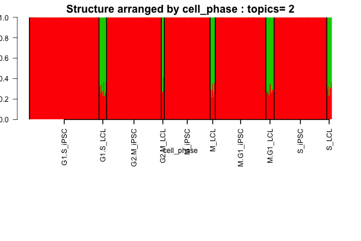
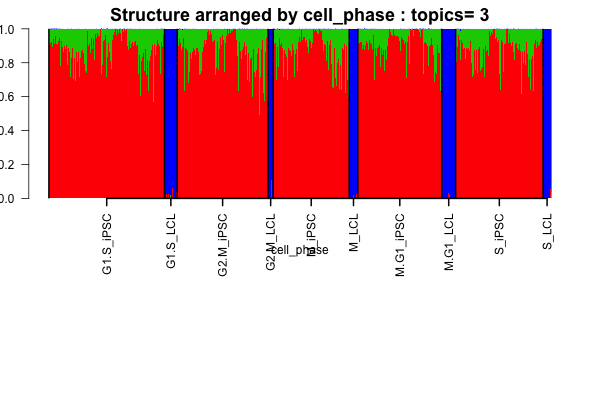
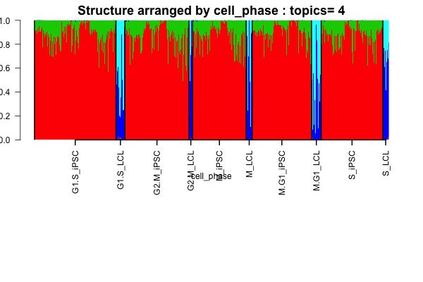
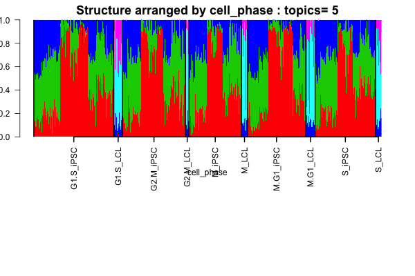

#### Structure on all genes (by batch)

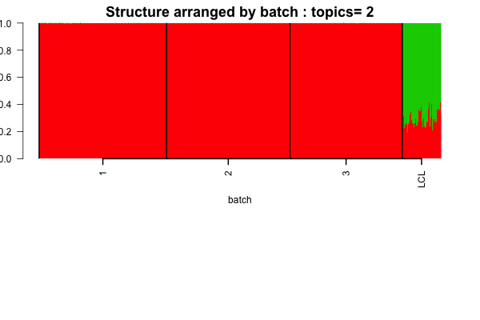
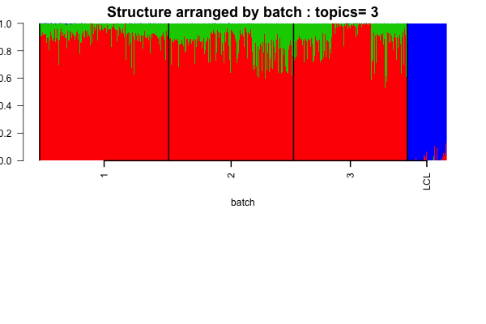
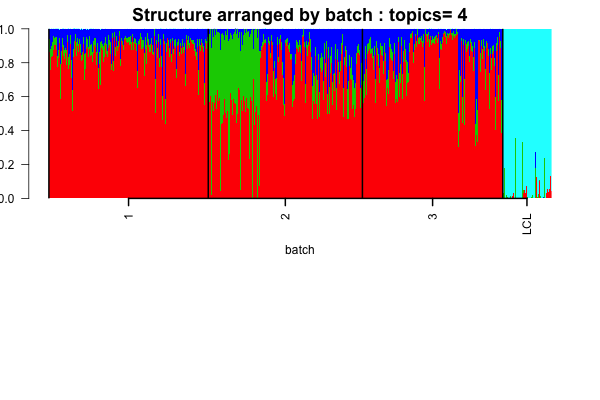
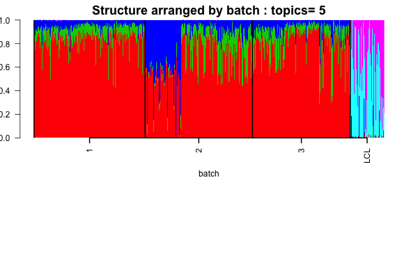

#### structure on all genes (by individual)

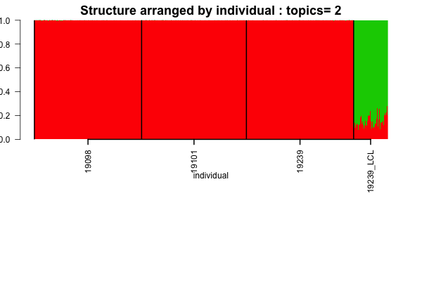

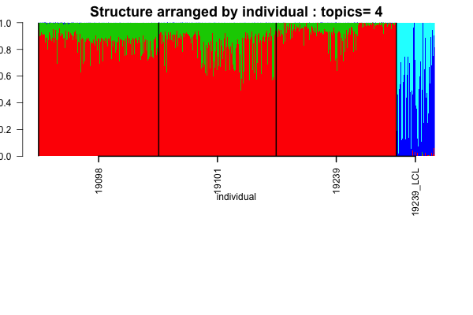
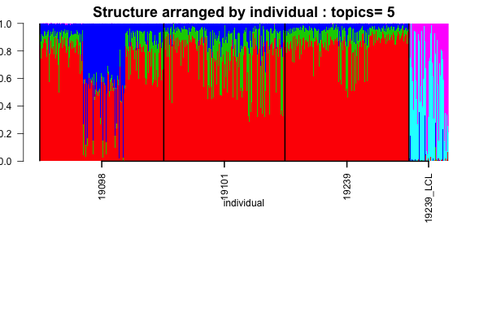

#### structure on all genes (by lane)


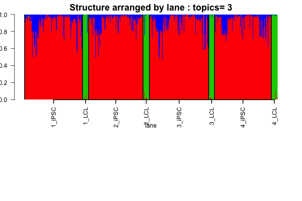
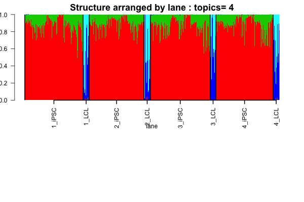
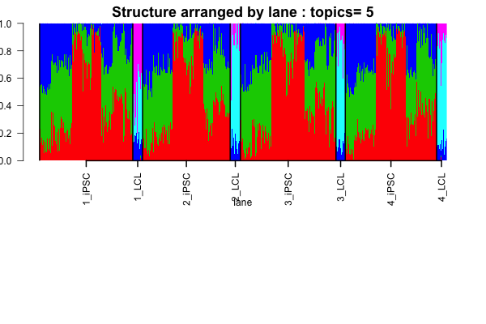

#### structure on all genes (by batch.individual)


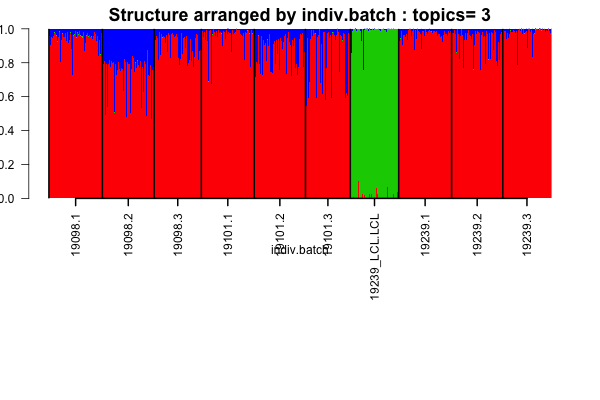
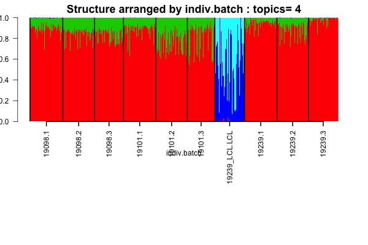
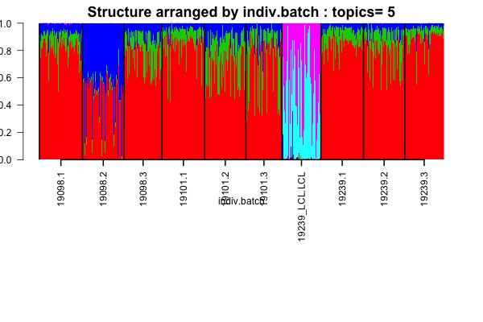

### Batch corrected model

Now we perform a individual and batch joint correction on the CPM data and then use the residuals derived from the model fit to perform batch corrected Structure analysis.

```{r echo=TRUE, eval=TRUE}

batch_corrected_pooled <- BatchCorrectedCounts(molecules_single_pooled,batch_indiv_pooled,use_parallel=TRUE)


```

Now we perform Structure on this batch corrected data 

```{r echo=TRUE, eval=TRUE}

nclus_vec <- 2:5;

#StructureObj(batch_corrected_pooled,nclus_vec,samp_metadata = samp_metadata, tol=0.001, batch_lab = NULL, path_rda="../../../project/rdas/topic_fit_ipsc_lcl_batchcorrect.rda",partition=rep('TRUE',dim(samp_metadata)[2]),path_struct = NULL);

ipsc_lcl_topics_batchcorrect <- get(load("../../../project/rdas/topic_fit_ipsc_lcl_batchcorrect.rda"));

if(!dir.exists("../../figures/ipsc_lcl_structure_batchcorrect")) dir.create("../../figures/ipsc_lcl_structure_batchcorrect")

for(num in 1:length(nclus_vec))
{
 if(!dir.exists(paste0("../../figures/ipsc_lcl_structure_batchcorrect/clus_",nclus_vec[num]))) dir.create(paste0("../../figures/ipsc_lcl_structure_batchcorrect/clus_",nclus_vec[num]))
obj <- StructureObj_omega(ipsc_lcl_topics_batchcorrect[[num]]$omega, samp_metadata = samp_metadata, batch_lab = NULL,partition = c("TRUE","TRUE","TRUE","TRUE","TRUE"),path_struct=paste0('../../figures/ipsc_lcl_structure_batchcorrect/clus_',nclus_vec[num]),control=list(cex.axis=1));
}

```


#### Structure on all genes (by cell phase)

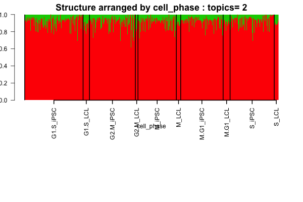
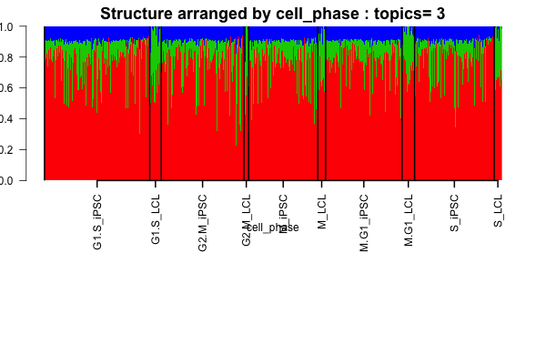
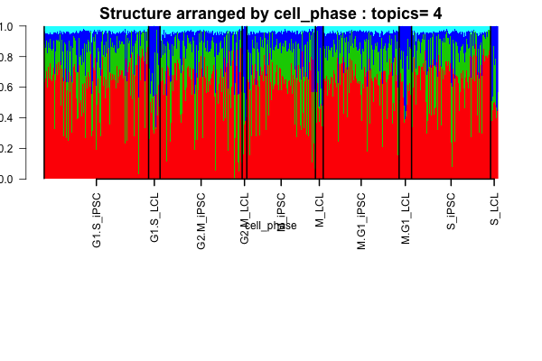
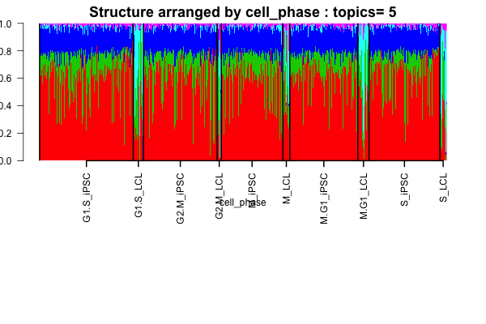

#### Structure on all genes (by batch)

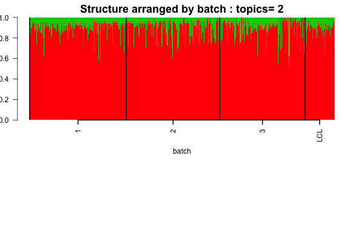
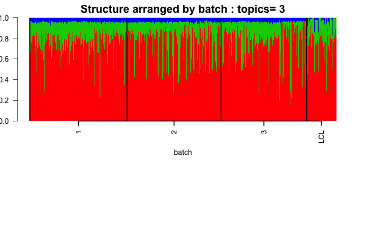
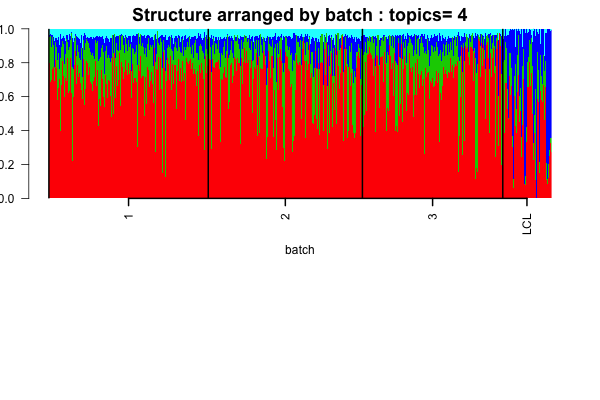
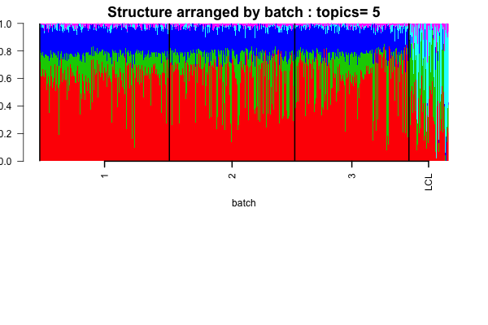

#### structure on all genes (by individual)

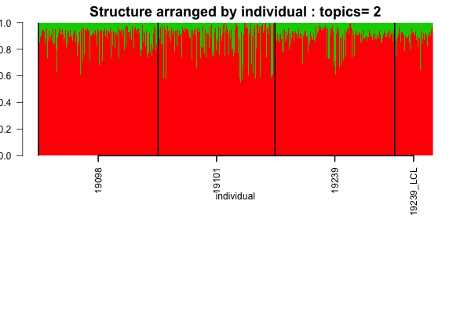
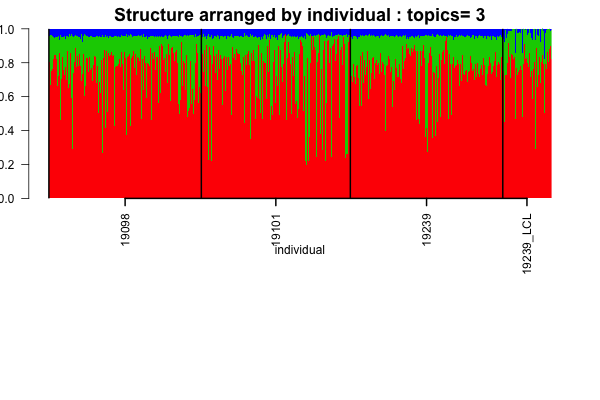
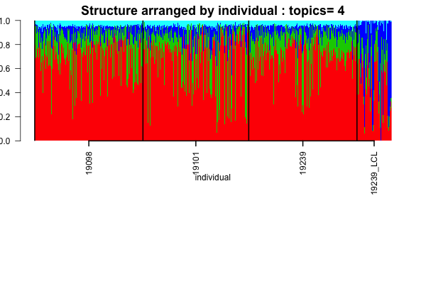
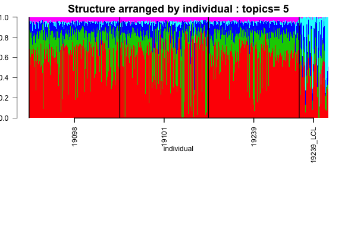

#### structure on all genes (by lane)

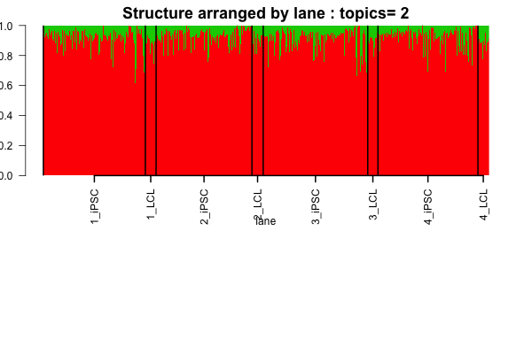
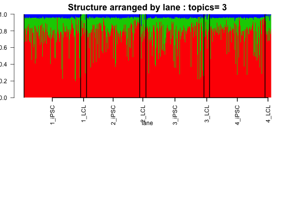
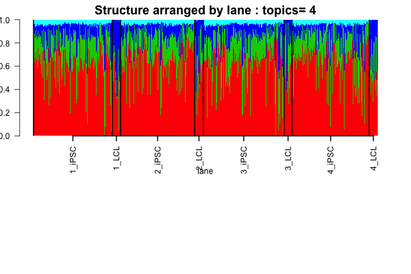
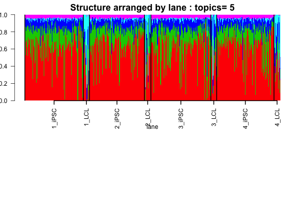

#### structure on all genes (by batch.individual)

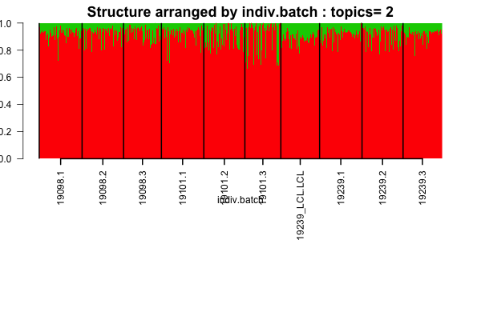
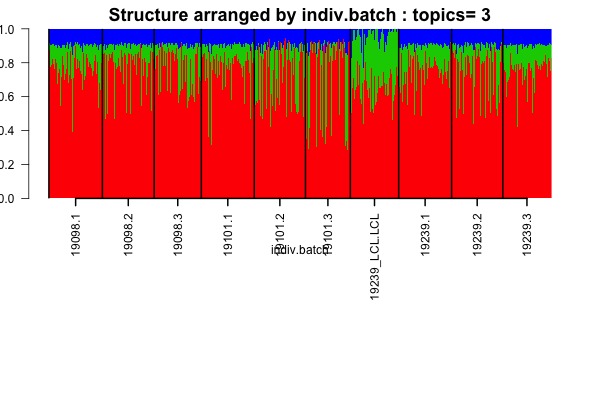
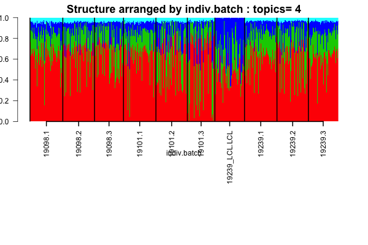
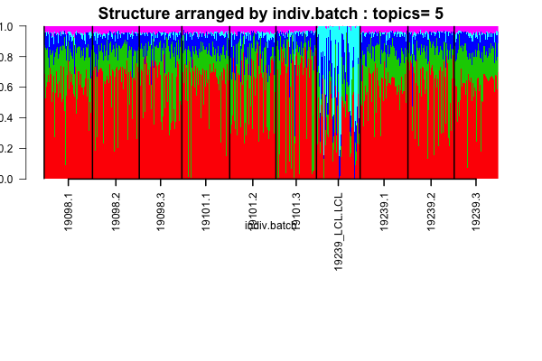


## Cell cycle gene analysis

We extract the cell cycle genes only and first do Structure plot without the batch individual correction

```{r echo=TRUE, eval=TRUE}
labs=unique(unlist(lapply(1:5, function(k) match(cell_cycle_genes_list[[k]],colnames(lcl_single_cells)))));
labs = labs[!is.na(labs)];

molecules_pooled_cell_cycle_genes <- molecules_single_pooled[,labs];
```


### Batch uncorrected model 

We now perform structure plot on the data

```{r echo=TRUE, eval=TRUE}

nclus_vec <- 2:5;

#StructureObj(molecules_pooled_cell_cycle_genes,nclus_vec,samp_metadata = samp_metadata, tol=0.001, batch_lab = NULL, path_rda="../../../project/rdas/topic_fit_ipsc_lcl_cellcycle.rda",partition=rep('TRUE',dim(samp_metadata)[2]),path_struct = NULL);

ipsc_lcl_topics_cellcycle <- get(load("../../../project/rdas/topic_fit_ipsc_lcl_cellcycle.rda"));

if(!dir.exists("../../figures/ipsc_lcl_structure_cellcycle")) dir.create("../../figures/ipsc_lcl_structure_cellcycle")

for(num in 1:length(nclus_vec))
{
 if(!dir.exists(paste0("../../figures/ipsc_lcl_structure_cellcycle/clus_",nclus_vec[num]))) dir.create(paste0("../../figures/ipsc_lcl_structure_cellcycle/clus_",nclus_vec[num]))
obj <- StructureObj_omega(ipsc_lcl_topics_cellcycle[[num]]$omega, samp_metadata = samp_metadata, batch_lab = NULL,partition = c("TRUE","TRUE","TRUE","TRUE","TRUE"),path_struct=paste0('../../figures/ipsc_lcl_structure_cellcycle/clus_',nclus_vec[num]),control=list(cex.axis=1));
}
```


#### Structure on cell cycle genes (by cell phase)

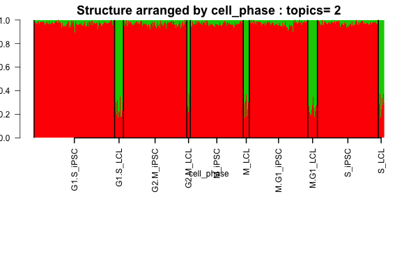
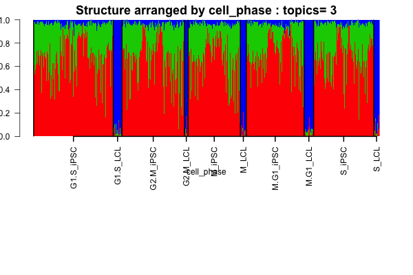
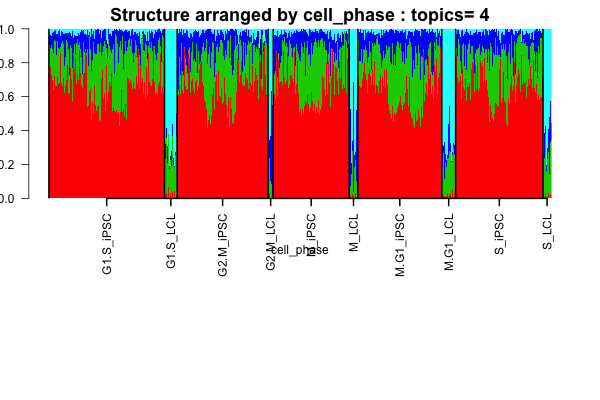
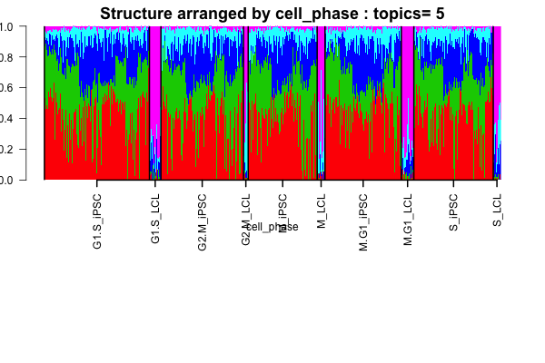

#### Structure on cell cycle genes (by batch)

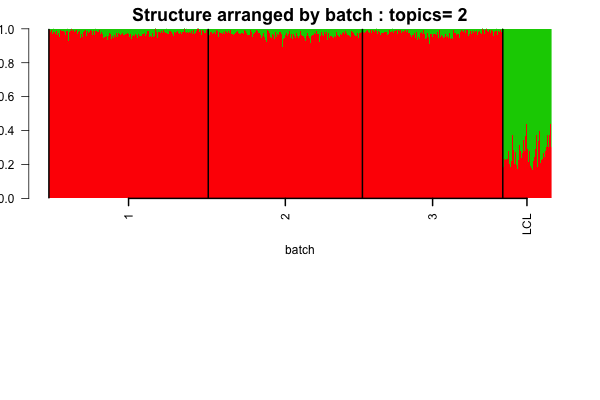
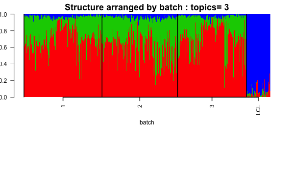
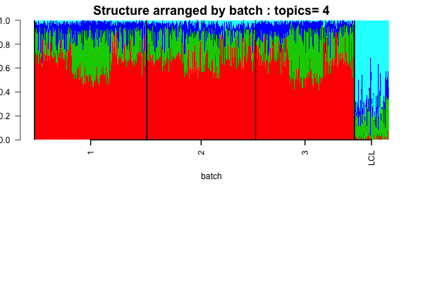
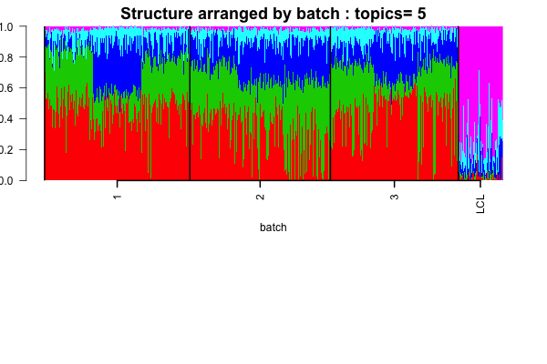

#### structure on cell cycle genes (by individual)

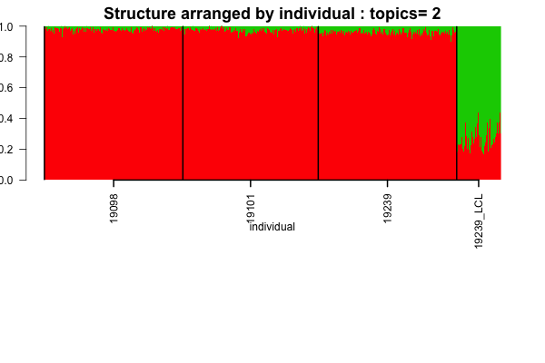
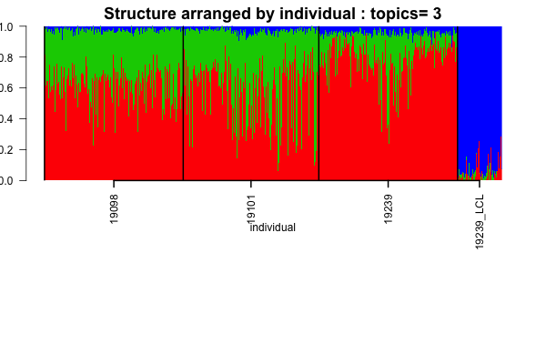
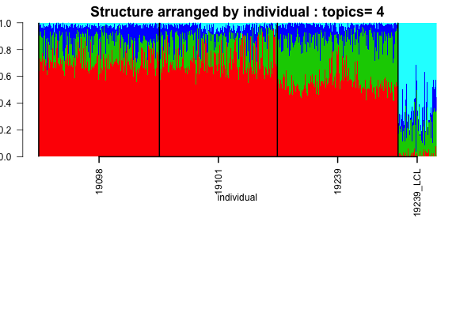
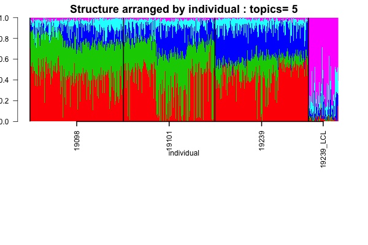

#### structure on cell cycle genes (by lane)

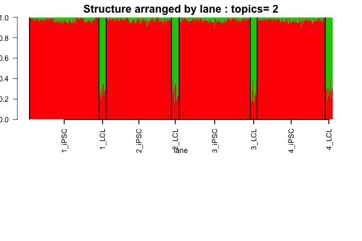
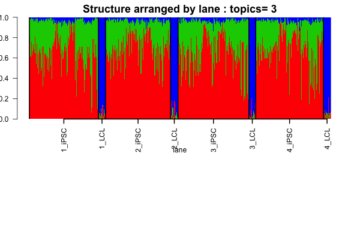

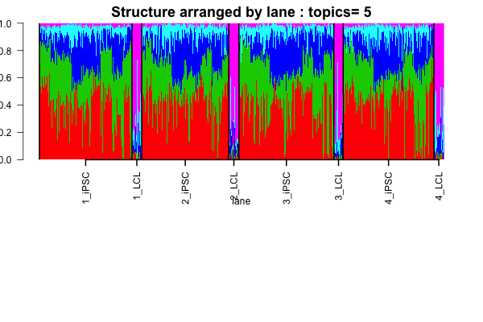

#### structure on cell cycle genes (by batch.individual)

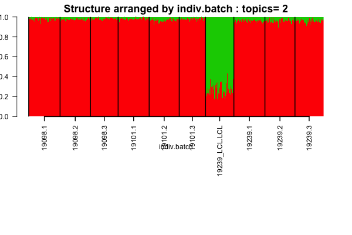
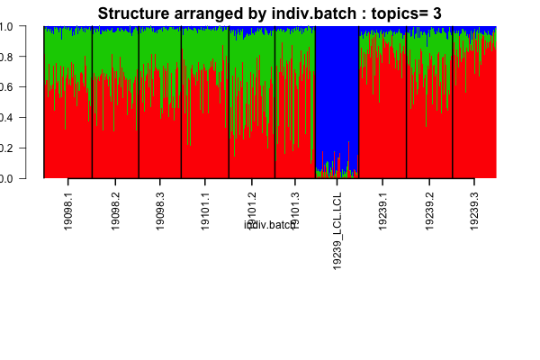

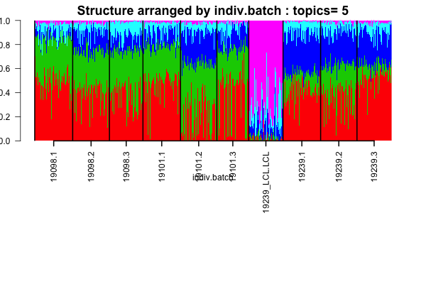


### Batch corrected model

Now we perform batch correction

```{r echo=TRUE, eval=TRUE}

batch_corrected_cell_cycle_genes <- BatchCorrectedCounts(molecules_pooled_cell_cycle_genes,batch_indiv_pooled,use_parallel=TRUE)

```

Now we perform Structure on this data 

```{r echo=TRUE, eval=TRUE}

nclus_vec <- 2:5;

#StructureObj(batch_corrected_cell_cycle_genes,nclus_vec,samp_metadata = samp_metadata, tol=0.001, batch_lab = NULL, path_rda="../../../project/rdas/topic_fit_ipsc_lcl_cellcycle_batchcorrect.rda",partition=rep('TRUE',dim(samp_metadata)[2]),path_struct = NULL);

ipsc_lcl_topics_cellcycle_batchcorrect <- get(load("../../../project/rdas/topic_fit_ipsc_lcl_cellcycle_batchcorrect.rda"));

if(!dir.exists("../../figures/ipsc_lcl_structure_cellcycle_batchcorrect")) dir.create("../../figures/ipsc_lcl_structure_cellcycle_batchcorrect")

for(num in 1:length(nclus_vec))
{
 if(!dir.exists(paste0("../../figures/ipsc_lcl_structure_cellcycle_batchcorrect/clus_",nclus_vec[num]))) dir.create(paste0("../../figures/ipsc_lcl_structure_cellcycle_batchcorrect/clus_",nclus_vec[num]))
obj <- StructureObj_omega(ipsc_lcl_topics_cellcycle_batchcorrect[[num]]$omega, samp_metadata = samp_metadata, batch_lab = NULL,partition = c("TRUE","TRUE","TRUE","TRUE","TRUE"),path_struct=paste0('../../figures/ipsc_lcl_structure_cellcycle_batchcorrect/clus_',nclus_vec[num]),control=list(cex.axis=1));
}
```

#### Structure on cell cycle genes - batch/individual corrected (by cell phase)

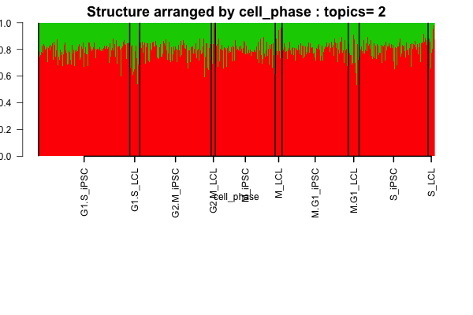
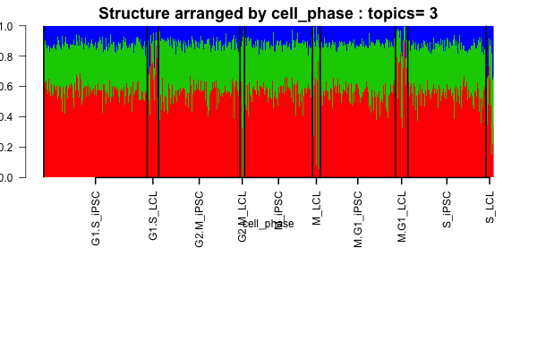
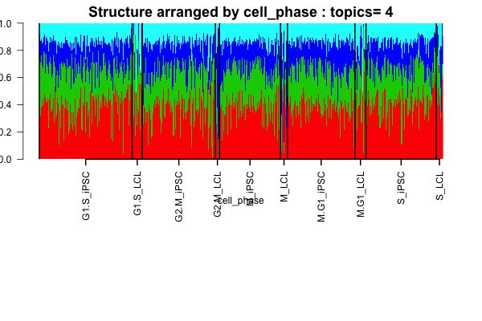
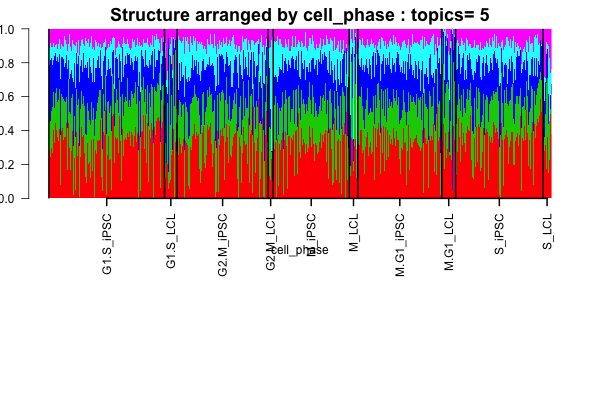

#### Structure on cell cycle genes - batch/individual corrected (by batch)

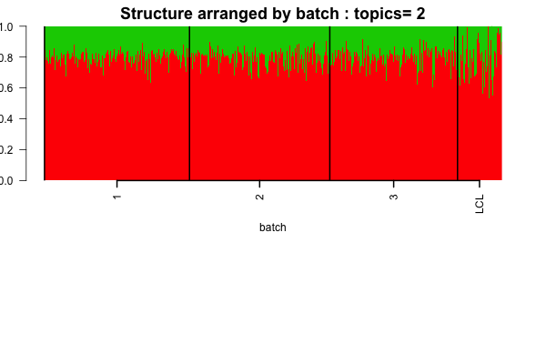
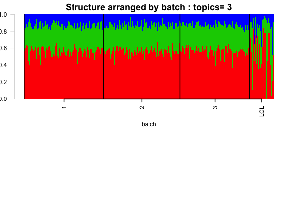
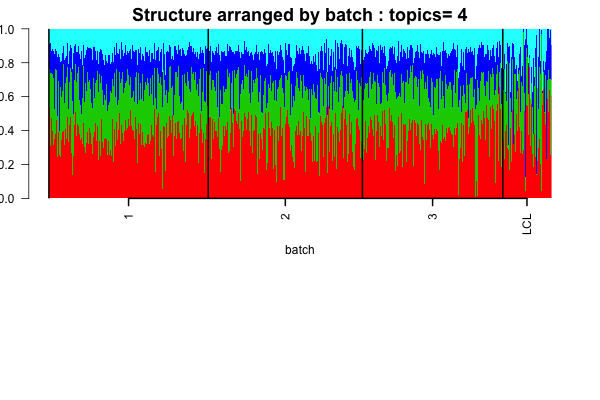
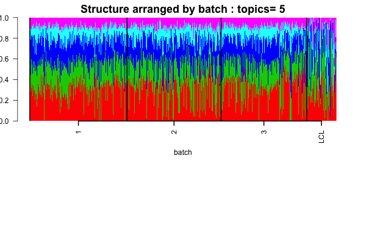

#### structure on cell cycle genes - batch/individual corrected (by individual)

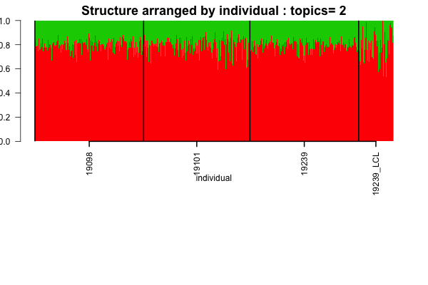

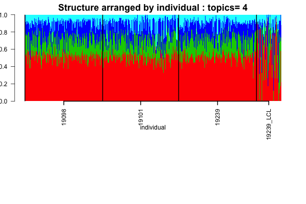
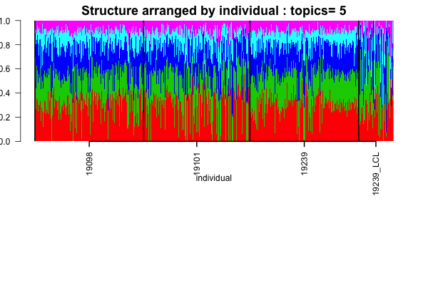

#### structure on cell cycle genes - batch/individual corrected (by lane)

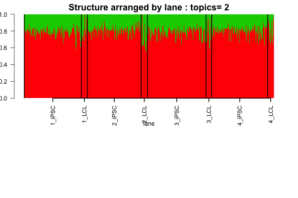
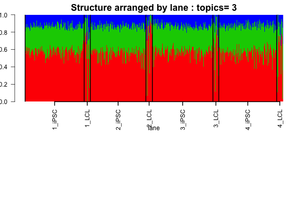
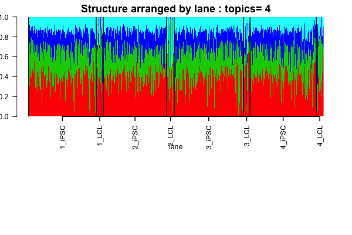
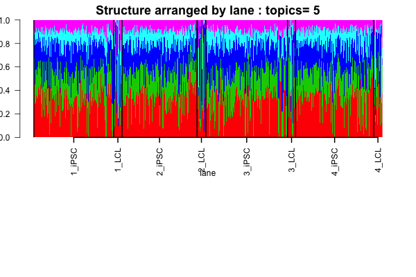

#### structure on cell cycle genes - batch/individual corrected (by batch.individual)

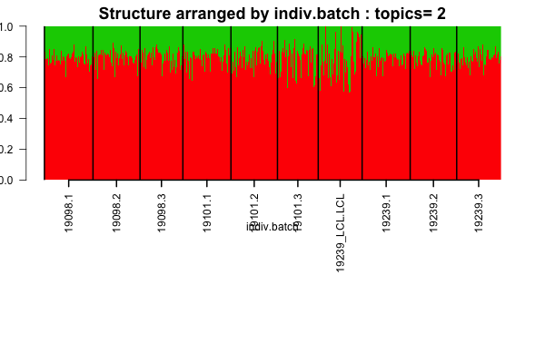
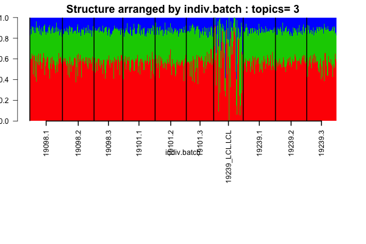
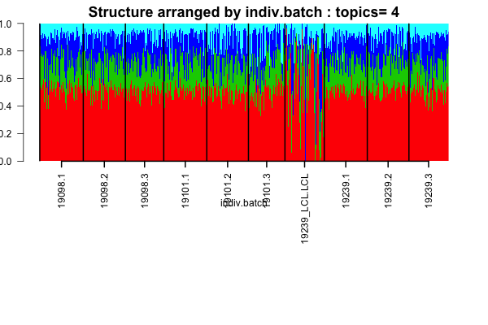
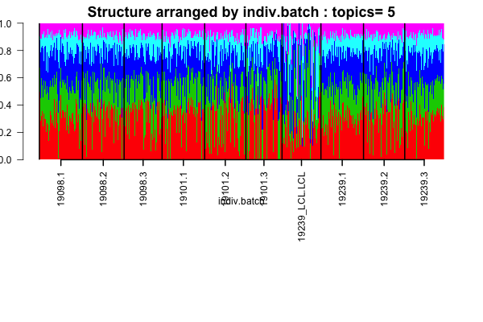

```{r }
sessionInfo()
