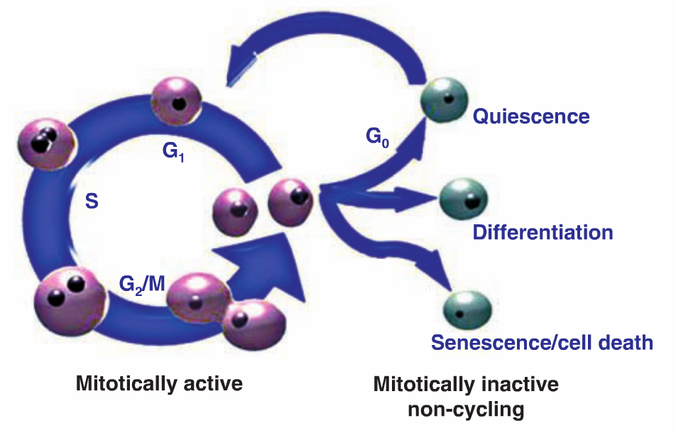

## Why cell cycle is important?

Single cell RNA-seq tries to capture the biological variation at the individual cell level. Such studies may be performed on cells from different tissues or cell lines, and may involve differentiated cells as well as embryonic or hematopoeitic stem cells. The biological questions of interest may range from determining how gene expression changes with respect to cell type, aging and the location of the cell in the differentatiation tree. However there is one effect that seems to have a profound impact on the gene expresion patterns and may drive the clustering of single cells (see Kowalczyk et al 2015). These are cell cycle effects. 

The importance of cell cycle in explaining variation has been discussed in various studies but [Kowalczyk et al (2015)](http://genome.cshlp.org/content/early/2015/10/01/gr.192237.115) tells us that cell cycle phase is the main source of variation even in the presence of cells coming from three types of hematopoeitic stem cells (long-term   HSCs or LT-HSCs, short term HSCs or ST-HSCs and multipotent progenitors MPP) of two different aging groups (young and old). On a side note, this paper is a very well written paper I think and very enlightening as well. 

Cell cycle effects may be of biological interest in some studies while in some others, the investigators may wish to eliminate cell cycle effects, thereby retaining other biological sources of variation of more interest. So, in latter scenario, cell cycle may be treated as a confounder or batch effect. 

## Overview 

When Kowalczyk et al (2015) applied clustering on the expression data, the three clusters found seemed to be following - cluster 1: G2/M phase genes are expressed, cluster 2: G1/S phase genes are expressed, cluster 3: no significant expression (quiescent or non-cycling). The cells from cluster 1 and cluster 2 are termed cycling cells. Almost a third of the analyzed genes were found to have significant cell cycle–dependent expression changes that were consistent among multiple HSC types or ages. To view the effects of differentation and aging, the authors then removed the cycling cells and focussed on the non cycling cells. This is not recommendable as it leads to significant loss of cells, which can also be driven by differentiation and aging. 

This paper showed cell cycle as a very strong effect. In Yoav single cell experiment, the cell cycle was again found to be a visible effect but not so strong. In fact, the cell cycle effects were confounded by the ribosomal protein genes and other growth related genes even after adjusting for individual level variation and the batches. The effects were mainly observed when we focussed on just the subset of cell cycle related genes (Whitfield et al 2002, Macosko et al 2015). 

The other issue has been the fact that many single cell experiments are driven by plate effects or other technical batch effects and cell phases may also be confounded with these effects, as a result of which it becomes difficult to interpret the structure we see in the data biologically (for example [Buettner et al 2015](http://www.nature.com/nbt/journal/v33/n2/full/nbt.3102.html)).

## What we have done

Our first checkpoint was to try and improve on the very ad-hoc method of cell ordering that was used by [Macosko et al 2015](http://www.sciencedirect.com/science/article/pii/S0092867415005498). We used the sinusoidally varying genes to obtain the relative ordering among the cells. Since there is an identifiability issue, we do not get back exact ordering of the cells but some rotation of that, which can be adjusted depending on the cell cycle genes behavior. We have tested our method on the unsynchronized cell experiment ain [Yoav's data](http://jhsiao999.github.io/singleCell-method/project/analysis/yoav_cellcycleR_cellcycle_genes.html) and synchronized cell experiment in [Spellman et al 1998](http://www.ncbi.nlm.nih.gov/pmc/articles/PMC25624/) and it seems to be working well in detecting the trajectory of the peaks and ordering the cells accordingly. We get some confidence from the fact that  Kowalczyk et al2015 also detected mainly two phases G1/S and G2/M from their analysis, because that is what we mainly obtain from [Yoav's data analysis](http://jhsiao999.github.io/singleCell-method/project/analysis/yoav_cellcycleR_cellcycle_genes.html). M/G1, G1 and G1/S all club together in cell times and G2/M and M club together (check the violin plots in the page link given above). Also, for Yoav's data after ordering, all the sinusoidal genes seem to peak in the M and G2.M phases and trough at the M/G1, G1 and G1/S.

However there are a few issues here, some of which probably can form short term goals and others more long-term.

## What we want to do

- From the cell ordering we have used so far on real data, we have not really seen sinusoidal patterns of gene expression, rather more of a peak in phases that these genes get expressed, check the qtlcharts in this [page](http://jhsiao999.github.io/singleCell-method/project/analysis/yoav_cellcycleR_cellcycle_genes.html). This means we are not really completing one sine cycle, rather it would be better if we model the cell cycle as one half of the sine cycle, or frequency to be 0.5. 

- We have not considered the G0 or the resting cells in our model, but it seems there is a bulk of cells which may just plainly be at rest. cellcycleR as of now forces all the cells to be part of the cell cycle and locate them somewhere on the cycle. In definition above due to Kowalczyk et al 2015, we assume all cells are cycling. We need to account for non-cycling cells as well. These would be the cells for which the phase-specific genes do not show strong expression for any of the cell phases. 

- The actual cell cycle process can be viewed through this diagram

So, before the cell starts the cell cycle, it may either differentiate, or go to senescence or do self-renewal by going through quiescence. Quiescence goes on for some time after which the cell becomes active and starts the cell cycle. I have not seen people bringing all these aspects into the cell cycle model for the gene expression data. It could be worth thinking about from a probabilistic modeling point of view.

- The selection of genes that have cell phase specific information is crucial to get information about cell phases. We have a list due to Whitfield et al 2002 and from Gene Annotation (GO) analysis, but there may be other genes that may have been overlooked before, may be turned on only in some cell types or under certain environmental conditions. Variable selection could be important for that. Also variable selection is important to make the cellcycleR run fast with better predictive accuracy. More on this in **var-select-topicmodels** Slack channel.

- We in the long run would probably want a model that can jointly pool in cell cycle, cell types, individual biological effects etc. The data in Kowalczyk et al 2015 and Yoav data may be good fit for that. 

- Some mathematical models have been proposed for stem cell regeneration, check [Tabatabai et al 2010](http://link.springer.com/article/10.1007%2Fs11517-010-0686-y), [Deasy et al 2003](http://www.ncbi.nlm.nih.gov/pubmed/12968108). The one paper I liked was [Lei et al 2014](http://www.pnas.org/content/111/10/E880). In this paper, the wuthors use genetic and epigenetic signature to drive the stem cell regenration model and it takes into account differentation, senescence, self-renewal etc. This kind of model may be useful for our modeling point of view as well.

Overall it seems we have a fairly broad arena to play around with the single cell stuff. 

